# Why a Framework Is Needed

<!-- journey:where -->
*Understand the framework › Why a framework is needed*
<!-- /journey:where -->

Most detection catalogs grow one rule at a time. A rule is added after an
incident, another to satisfy an auditor, a batch arrives with a vendor content
pack. Each makes sense when it is written. Over a few years the catalog becomes
large, uneven and difficult to reason about: nobody can say with confidence
what it covers, why a given rule exists, or what would be lost if it were
removed.

This chapter sets out why a structured approach is needed. It defines the terms
used throughout the guide, describes the principles the framework is built on,
and introduces the three kinds of driver from which every detection originates:
risk, threat and compliance.

## Introduction

### Audience

This document is intended for:

| **Role** | **Focus Area** |
|-------------|-------------------|
| **Security Managers** | Strategic oversight and governance |
| **SOC Managers** | Operational management and coordination |
| **SOC Analysts** | Day-to-day monitoring and analysis |
| **Detection Engineers** | Technical development and implementation |
| **Security Professionals** | Overall security operations |

The guide is written primarily for detection engineers and SOC leads, who carry out most of the work it describes. Security managers will find the conclusions of each chapter summarized at its end.

### Scope

This **Detection Engineering Framework** was built to address the detection of cyber threats & attack tactics techniques and procedures appropriate to the SOC. The objective of building a Detection Engineering Framework is to better protect the organization's valuable assets by designing and developing detection use cases using a holistic approach that connects **Risk**, **Threat** & **compliance requirements**.

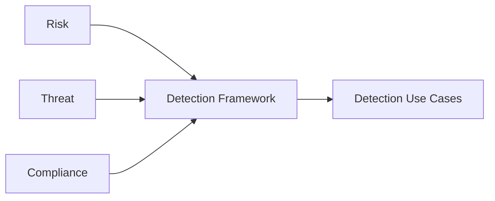

> **Disclaimer**: Following the guidelines and recommendations in this document does not guarantee a secure environment, or that all security incidents will be prevented. Absolute security is impossible to achieve on any open network. However, security risks can be reduced by establishing a good security policy together with sound administration practices; monitoring and responding to security incidents; testing and evaluating security; and improving, securing and managing security weaknesses on an on-going basis.

---

## Detection Engineering Framework

### Overview

This framework provides a structured approach to enhancing an organization's cybersecurity posture through systematic threat detection and response. It integrates several key concepts to ensure comprehensive and effective security operations.

### Key Concepts

- **Cybersecurity Use Case:** In the context of cybersecurity, a **use case** refers to a specific scenario or example where security measures are implemented to prevent, detect, or respond to cyber threats. It outlines how a system or process is applied to address a particular cybersecurity challenge. Use cases serve as the foundation, defining the specific threats and scenarios the framework aims to address.

- **Detection Engineering:** **Detection engineering** refers to the process of designing and developing effective methods and techniques to identify, detect and respond to security threats and incidents. It is a specialized and systematic discipline focused on building, implementing, and continuously refining mechanisms to identify malicious activities, anomalies, or indicators of compromise within an organization's systems and networks. It applies an engineering mindset to threat detection, moving beyond simply writing static detection rules.

- **Response Playbooks:** **Response playbooks** provide predefined steps and actions to be taken in response to specific security events or incidents. They are crucial for ensuring a consistent, rapid, and effective reaction once a threat is detected.

### The Detection Engineering Framework

The **Detection Engineering Framework** combines these core concepts to create a comprehensive and structured approach for developing, managing, and continuously improving security monitoring and incident response capabilities.

At its core, the framework is driven by well-defined **cybersecurity use cases**, which articulate the specific threats and attack scenarios relevant to the organization. These use cases directly inform the **detection engineering** process, guiding the design, development, and refinement of robust detection mechanisms. Crucially, this engineering effort also encompasses the creation and integration of **response playbooks**, as effective detection is only truly valuable when paired with a clear, predefined plan for action and mitigation. This ensures that every identified threat has a corresponding, actionable plan for mitigation and remediation.

This framework emphasizes the importance of proactive identification, continuous monitoring, and orchestrated response to security threats, enabling organizations to build a more resilient and adaptive defense against the evolving threat landscape.

### Why adopt a Use Case & Detection Engineering Framework?

Essentially, use cases describe manifestations of threats from a high level (the modus operandi of the cyber criminals) to the lowest level (concrete security events in the infrastructure such as exploits, failed logins, etc.). Use cases also describe follow-up actions (incident response) and are tied with business drivers to show how security monitoring reduces risk in the organization.

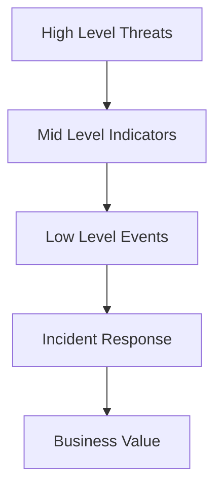

Within the complexity of the security architecture, framework can provide structure and overview. Such frameworks enable control over the development of the use cases and provide insight into identify how well an organization can defend against cyber threats.

**The Detection Engineering Framework should allow the SOC:**

- To ensure stakeholder objectives are met uniformly
- To capture gaps and challenges early on during the creation of use cases or detections
- To have a holistic "frame of reference" where detection use cases can be categorized into
- To engineer detection capabilities in a consistent & methodological manner
- To quickly see where use cases or detections are lacking and need more attention
- To facilitate a phased approach of expanding new use cases based on a large variety of inputs and priorities in the form of Use Case Roadmap

### Principles of Detection Engineering Framework

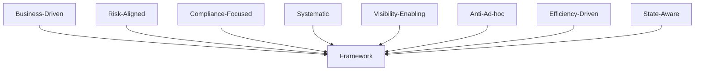

The key principles driving this framework:

- **Business-Driven**: The creation of use cases should be driven by the organization's business requirements
- **Risk-Aligned**: The use cases must align with the business's risk appetite over any form of asset
- **Compliance-Focused**: The use case framework should provide structured control over the compliance requirements of the organization
- **Systematic**: The creation of use cases must follow a systematic process to eliminate or reduce errors
- **Visibility-Enabling**: The use case framework should create a foundation for the ability to assess the state of visibility and detection capability
- **Anti-Ad-hoc**: The use case framework must reduce the ad hoc detection of threats for the organization
- **Efficiency-Driven**: The use case framework should eliminate redundant & duplicate methods of managing use cases
- **State-Aware**: The management of the use cases must articulate the state of the use cases at any given point of time

### What does the Framework consist of?

The framework includes:

| **Component** | **Description** |
|------------------|-------------------|
| **Fundamentals** | How business risk, threats and compliance requirements drive the framework |
| **Lifecycle** | Practical Use Case & Detection Engineering lifecycle management process |
| **Development Guide** | Practical guide to develop correlation and detection rules |
| **Catalog Guide** | Suggested guide to maintain use cases and detection rules in catalog format |
| **Templates** | Series of templates, processes and conventions that support the framework |

---

### Challenges of Creating & Managing Use Cases

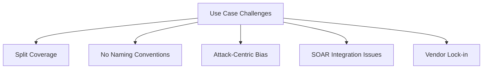

1. **Split Coverage**: Most out-of-the-box use cases are split up from each other based on their rule content package which can be put (after some analysis of the detection logic) under the same "use case" as they have the same detection scope.

2. **Naming Issues**: Most SIEM out-of-the-box (and later custom added rules) do not have an overarching naming convention over all rules.

3. **Detection Bias**: Most use case approaches have an Attack-centric or quantitative detection bias. Most SIEM Vendors have attempted to organize use cases in a Use Case Framework that primarily focuses on a single limited threat model (kill chain or ATT&CK Framework) this misses critical categories like Self-monitoring, localized anomaly detection (that is not attack centric) and distinctions between quantitative threat modeling and qualitative threat modeling.

4. **SOAR Integration**: Use Cases are hard to align with a SOAR playbooks platform without a framework. Most vendors fail to accommodate the emergence of SOAR technologies that are trying to connect automated or semi-automated playbooks to SIEM use cases.

5. **Vendor Complexity**: SIEM Vendor Taxonomy overly complex or not generalizable. Many SIEM vendors have attempted to standardize detection through taxonomy of detection categories, but these categories are generally limited only to the SIEM vendor itself and hard to generalize to other detection technologies of other vendors like IDS, IPS, UBA and others.

---

## Drivers for Use Cases

Before going any further, it is important to provide a definition of use cases. This is necessary, because of the fact that the term is used to describe a variety of elements in different publications.

> **Definition**: "A use case in the context of this framework is a security monitoring scenario aimed at detecting manifestations of cyber threats, managing risk, and aligning with compliance requirements; if any of these are actualized, the use case also guides our response."

In addition to this a use case also has a **strategical**, **tactical** and **operational** component. This definition emphasizes the fact that the focus of the framework is on the **'detect'** and **'respond'** phase of the NIST cybersecurity framework.

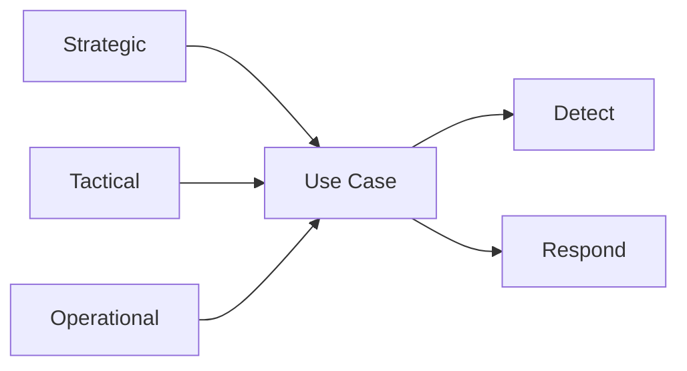

Naturally, the events and incidents that flow from the security monitoring architecture can be used to improve protection mechanisms or further refine the threat identification. While threats are a core driver for security monitoring, they are not the only driver. Other aspects of the organizational environment must be considered as well such as **risk** and **compliance** obligations.

Developing the right use cases or detection rules, and having an effective development and implementation process, is more than half the battle in reducing response time to a potential attack and minimizing its impact.

**Use cases must be customized for each organization**, reflecting:

- Organization's current unique requirements and risk, threat and compliance profile
- Current threat landscape, based on the organization's industry vertical
- Types of assets owned
- Organization's operating regions, applications and services used

### Risk, Threats and Compliance Overview

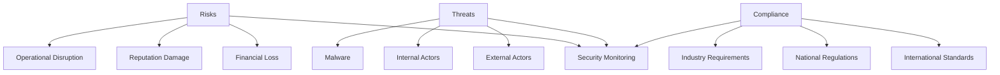

**Risks**

Cybersecurity risk is the probability of exposure or loss resulting from a cyber-attack or data breach on your organization. A better, more encompassing definition is the potential loss or harm related to technical infrastructure, use of technology or reputation of an organization.

Organizations are becoming more vulnerable to cyber threats due to the increasing reliance on computers, networks, programs, social media and data globally. Data breaches, a common cyber-attack, have massive negative business impact and often arise from insufficiently protected data.

**Threats**

Any potential occurrence that may cause an undesirable or unwanted outcome for an organization or for a specific asset is a threat. Threats are any action or inaction that could cause damage, destruction, alteration, loss, or disclosure of assets or that could block access to or prevent maintenance of assets.

Cyber threats refer to the possibility of a successful cyber-attack that aims to gain unauthorized access, damage, disrupt, or steal an information technology asset, computer network, intellectual property or any other form of sensitive data.

**Compliance**

As the number and severity of cyber-attacks increases, industry standards organizations and governments seek to enforce cybersecurity by establishing more stringent compliance requirements. In cybersecurity, compliance means creating a program that establishes risk-based controls to protect the integrity, confidentiality, and accessibility of information stored, processed, or transferred.

Organizations subject to industry or regional cybersecurity regulations are required by law to meet compliance and take the prescribed actions following the discovery of a data breach.

### Aligning to Business Context

Each line of business has their own risks and threats. For example, the threats of banking firm is not the same as a healthcare or Government entity. So, understanding the line of business would help well in plotting the threat actors and attack motivation.

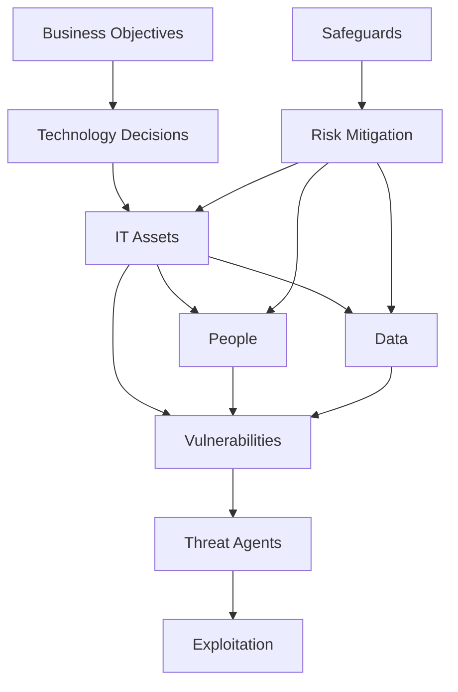

It's important to understand what the organization business objectives are specifically for a given period of time. As these business objectives influence and shape the technology decisions. The technology decisions in turn become the assets in the shape of IT equipment, People and Data that must be safeguarded every single day because they are bound to have vulnerabilities that possess the risk of being exploited by Threat agents.

**Cyber Elements Relationship:**

- **Threats** exploit **vulnerabilities**, which results in **exposure**
- **Exposure** is **risk**, and **risk** is mitigated by **safeguards**
- **Safeguards** protect **assets** that are endangered by **threats**

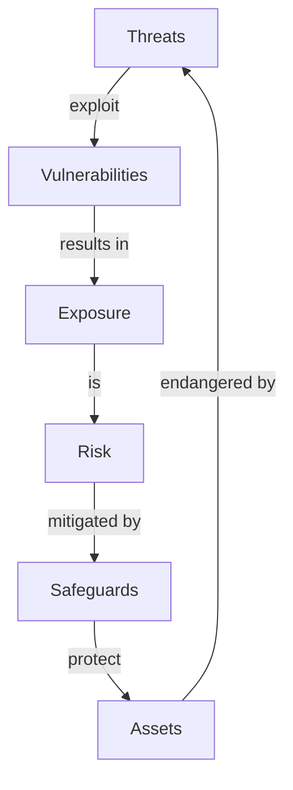

Businesses also evolve continuously. Thus, it is possible that changes to the business layer of the use case may be required. These changes may also need to be reflected in operational implementation. For example, changes in demands regarding use case output may lead to new assets being monitored or new monitoring rules being implemented.

<strong>Defining Threats and Risks - Click to expand</strong>

**Defining Threats and Risks:**

To grasp the essence of threats and risks, let's start by defining each concept individually. In the realm of cybersecurity, a **threat** refers to a specific type of malicious actor, an entity, or an event that has the potential to exploit vulnerabilities and compromise the security of computer systems, networks, or data. These threats may come in the form of hackers, malware, viruses, phishing attacks, or social engineering tactics.

On the other hand, a **risk** is the potential for loss, harm, or negative consequences resulting from the exploitation of vulnerabilities by threats. Risks encompass assessing the likelihood and potential impact of threats on an organization's information assets, including data confidentiality, integrity, and availability.

**Threats: The 'What' of Cybersecurity:**

Imagine a medieval castle fortified with high walls, towers, and guards. In the context of cybersecurity, threats can be likened to the external forces attempting to breach the castle's defenses. These forces could be hostile invaders, spies, or even traitors within the castle walls. Similarly, cybersecurity threats are the specific instances of potential harm, often associated with intentional malicious activities or accidental occurrences.

**Risks: The 'How' and 'Why' of Cybersecurity:**

While threats focus on the external forces attempting to breach our digital defenses, risks provide a broader perspective by considering the overall uncertainty and potential impact to our information assets. In our castle analogy, risks can be compared to the assessment of the castle's vulnerability, the potential impact of an invasion, and the consequences for the kingdom.

**The Interplay Between Threats and Risks:**

While threats and risks are distinct concepts, they are intertwined and mutually influence each other in the realm of cybersecurity. Threats are specific manifestations of potential harm, often originating from intentional malicious activities or accidental occurrences. Risks, on the other hand, encompass a broader range of potential threats, vulnerabilities, and their associated consequences.

---

### Risk Drivers

All IT systems have risk. There is no way to eliminate 100 percent of all risks. Instead, upper management and key stakeholders must decide which risks are acceptable and which are not. Determining which risks are acceptable requires detailed and complex asset and risk assessments.

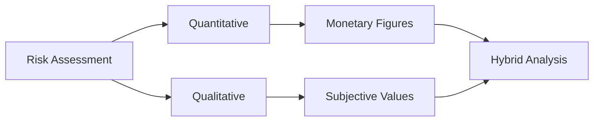

There are **two risk assessment methodologies**:

- **Quantitative**: Assigns real monetary figures to the loss of an asset
- **Qualitative**: Assigns subjective and intangible values to the loss of an asset

Both methods are necessary for a complete risk analysis. Most environments employ a **hybrid** of both risk assessment methodologies in order to gain a balanced view of their security concerns.

<strong>Types of Risk Drivers - Click to expand</strong>

**Quantitative & Qualitative Pertinence**

The quantitative method results in concrete probability percentages. That means the end result is a report that has monetary figures for levels of risk, potential loss, cost of countermeasures, and value of safeguards. This report is usually fairly easy to understand, especially for anyone with knowledge of spreadsheets and budget reports.

Qualitative risk analysis is more scenario based than it is calculator based. Rather than assigning exact monetary figures to possible losses, you rank threats on a scale to evaluate their risks, costs, and effects. The method of combining quantitative and qualitative analysis into a final assessment of organizational risk is known as **hybrid assessment** or **hybrid analysis**.

**Business Impact Analysis**

Business impact analysis (BIA) is a systematic process to determine and evaluate the potential effects of an interruption to critical business operations as a result of a disaster, accident or emergency. A BIA is an essential component of an organization's business continuance plan.

One of the basic assumptions behind BIA is that every component of the organization is reliant upon the continued functioning of every other component, but that some are more crucial than others and require a greater allocation of time, effort and funds in the wake of a disaster.

---

### Threat Drivers

Threat drivers are the factors or conditions that contribute to the emergence, growth, or impact of threats in the cybersecurity landscape. They provide insight into the motivations, capabilities, and techniques of threat actors, helping organizations understand the potential risks they face.

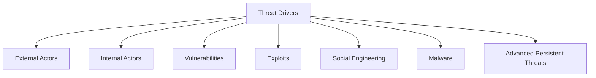

**Common threat drivers include:**

| **Threat Driver** | **Description** |
|----------------------|-------------------|
| **External Actors** | Individuals, groups, or organizations outside the target organization |
| **Internal Actors** | Individuals within an organization who pose a security risk |
| **Vulnerabilities** | Weaknesses or flaws in software, hardware, or system configurations |
| **Exploits** | Tools, techniques, or malicious code that take advantage of vulnerabilities |
| **Social Engineering** | Psychological manipulation techniques to deceive individuals |
| **Malware** | Malicious software designed to gain unauthorized access or disrupt systems |
| **APTs** | Sophisticated, targeted attacks by well-resourced threat actors |

<strong>Types of Threat Drivers - Click to expand</strong>

**Threat Intelligence**

Cyber threat intelligence is what cyber threat information becomes once it has been collected, evaluated in the context of its source and reliability, and analyzed through rigorous and structured tradecraft techniques by those with substantive expertise and access to all-source information.

**Threat Modelling**

Threat modeling is a crucial component of any robust use case framework as it provides a systematic approach to identify, assess, and mitigate potential threats and risks. By incorporating threat modeling into the use case development process, organizations can enhance the security of their systems, applications, and infrastructure.

**Threat Hunting**

Threat hunting is the proactive cybersecurity practice of searching for hidden threats already in an organization's environment. Threat hunting is necessary because many adversaries engineer their attacks to bypass an organization's perimeter and defenses in order to sneak in undetected.

**Lessons Learned From Incident Response**

Incident response activities originating from security alerts are also input into the use case management process. This loopback mechanism ensures that monitoring is effective and efficient. After all, breaches must be detected and false-positives should be avoided as much as possible.

---

### Compliance Drivers

### What is Cybersecurity Compliance?

**Cybersecurity Compliance** involves meeting various controls (usually enacted by a regulatory authority, law, or industry group) to protect the **confidentiality**, **integrity**, and **availability** of data.

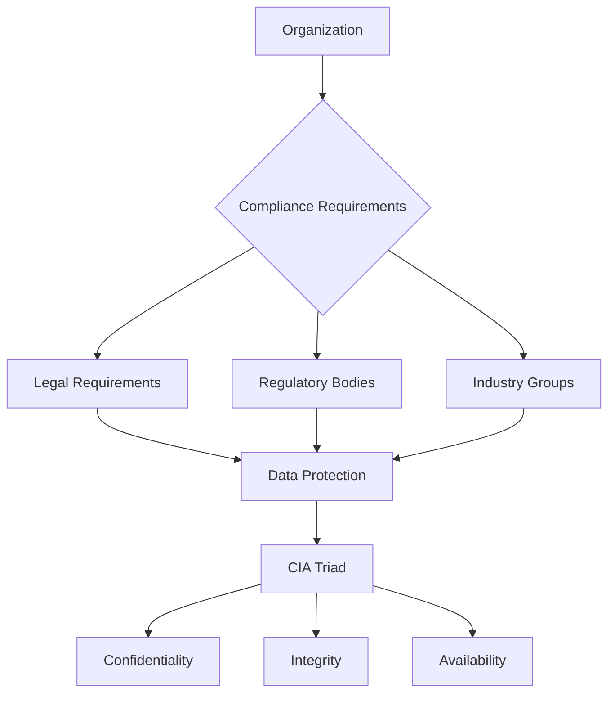

### Compliance Requirements Sources

Compliance requirements vary by **industry** and **sector**, but typically involve using an array of specific organizational processes and technologies to safeguard data. Controls come from a variety of sources including:

- **CIS** (Center for Internet Security)
- **NIST Cybersecurity Framework**
- **ISO 27001**

> **Important**: Many of these standards impose rules that mandate monitoring key IT systems and security controls.

<strong>Types of Compliance Drivers - Click to expand</strong>

## Types of Compliance Drivers

### International Cybersecurity Regulations
>
> Compliance standards adopted by organizations due to regulations that are **not limited by national boundaries**.

**Examples:**

- **ISO 27001** - Information Security Management
- **GDPR** - General Data Protection Regulation
- **Common Criteria** - IT Security Evaluation

### National Cybersecurity Regulations
>
> Compliance standards **imposed or suggested** by the government of the country.

**Examples:**

- **Qatar CSF** - Qatar Cybersecurity Framework
- **Cyber Essentials** - UK Government Scheme
- **BSI IT-Grundschutz** - German IT Security Standards

### Operating Sector Regulations
>
> **Industry-specific standards** that organizations must follow to comply with obligations for business operations.

**Examples:**

- **PCI DSS** - Payment Card Industry Data Security Standard
- **IEC 62443** - Industrial Communication Networks Security

### Internal Information Management Policies
>
> **Organization-specific policies** or set of rules mandated by the internal information security department.

---

## In brief

- A use case is a monitoring scenario for detecting a threat, managing a risk or
  meeting a compliance obligation, together with the response it guides. It has
  strategic, tactical and operational layers.
- Every detection originates from at least one of three drivers: risk, threat
  or compliance. The framework requires that link to be recorded.
- Without a framework, catalogs fragment. Coverage splits across vendor content
  packs, naming is inconsistent, and nothing connects a rule to the reason it
  exists.
- The framework's principles are that detection work should be driven by the
  business, aligned to risk appetite, systematic, and able to show the state of
  coverage at any time.

## What comes next

With the drivers established, the next chapter presents the lifecycle that
turns a driver into a working detection: its four phases, the steps within
them, and the principle of two-way traceability that connects them.

<!-- journey:next -->

---

**Previous:** [Welcome](README.md) · **Next:** [The lifecycle at a glance](Detection-Engineering-Lifecycle.md)

<!-- /journey:next -->
