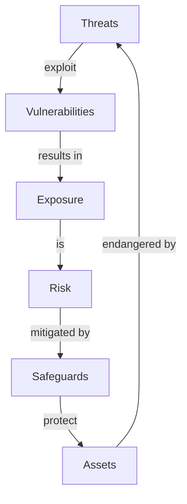

# Why a Framework Is Needed

<!-- journey:where -->
*Understand the framework › Why a framework is needed*
<!-- /journey:where -->

Most detection catalogs grow one rule at a time. A rule is added after an
incident, another to satisfy an auditor, a batch arrives with a vendor content
pack. Each makes sense when it is written. Over a few years the catalog becomes
large, uneven and difficult to reason about: nobody can say with confidence
what it covers, why a given rule exists, or what would be lost if it were
removed.

This chapter sets out why a structured approach is needed. It defines the terms
used throughout the guide, describes the principles the framework is built on,
and introduces the three kinds of driver from which every detection originates:
risk, threat and compliance.

## Introduction

### Audience

The guide is written primarily for detection engineers and SOC leads, who carry
out most of the work it describes. It is also relevant to:

| Role | What the guide offers |
| --- | --- |
| Security managers | Governance, prioritization and how to assess a program |
| SOC analysts | How alerts are designed, and how their feedback shapes tuning |
| Incident responders | How response plans are built into detections |
| Auditors and risk teams | How each detection traces back to a risk or obligation |

Security managers will find the conclusions of each chapter summarized at its
end.

### Scope

The framework covers the detection of, and response to, cyber threats within a
security operations center. Its aim is to protect an organization's assets by
building detections that are connected to the organization's actual risks,
threats and compliance obligations, rather than accumulated rule by rule.

It concentrates on the *detect* and *respond* functions of security. Prevention
and recovery are outside its scope except where they meet detection.

> **Disclaimer.** Following the framework does not guarantee a secure
> environment or prevent every incident. Absolute security is not achievable on
> any connected network. Risk can be reduced through sound security policy and
> administration, monitoring and response, regular testing, and continuous
> improvement.

---

## Detection Engineering Framework

### Overview

The framework is a structured method for building, operating and maintaining a
detection capability. It rests on three ideas, defined below: the use case,
detection engineering, and the response playbook.

### Key Concepts

- **Use case.** A specific security monitoring scenario: a threat, risk or
  obligation, the activity that would indicate it, and the response it calls
  for. Use cases are the unit of planning in the framework.
- **Detection engineering.** The discipline of designing, building, testing and
  maintaining the mechanisms that identify malicious or anomalous activity. It
  applies engineering practice to detection, rather than treating rules as
  one-off pieces of configuration.
- **Response playbook.** The predefined steps to take when a detection fires. A
  playbook turns an alert into a consistent, timely action.

### The Detection Engineering Framework

The framework joins these three ideas into a single lifecycle. Use cases state
which threats and scenarios matter to the organization. Those use cases direct
the detection engineering work: what to build, and to what standard. Each
detection is then paired with a response playbook, because a detection is only
useful if the organization knows what to do when it fires.

### Why adopt a Use Case & Detection Engineering Framework?

A use case describes a threat at every level, from the attacker's broad method
down to the concrete events it produces, such as an exploit attempt or a run of
failed logins. It also describes the response, and ties both to the business
reasons for monitoring. That link is what allows a SOC to show how its
monitoring reduces risk.

Security architectures are complex, and without a framework the detection
capability tends to grow unevenly. A framework allows a SOC to:

- meet stakeholder objectives consistently;
- find gaps and obstacles early, while a detection is still being designed;
- place every detection within a shared frame of reference;
- build detections in a consistent, methodical way;
- see quickly where coverage is weak; and
- expand coverage in planned stages, through a roadmap that balances many
  inputs and priorities.

### Principles of Detection Engineering Framework

The framework rests on eight principles:

- **Business-driven.** Detections exist because of business requirements.
- **Risk-aligned.** Detections reflect the organization's risk appetite for each
  kind of asset.
- **Compliance-aware.** The framework gives structured control over the
  organization's compliance obligations.
- **Systematic.** Detections are built through a defined process, which reduces
  errors.
- **Visibility-enabling.** The framework makes it possible to assess what the
  organization can and cannot see.
- **Deliberate rather than ad hoc.** New detections are planned, not improvised.
- **Efficient.** Duplicate and redundant ways of managing detections are
  removed.
- **State-aware.** The status of every detection is known at any point in time.

### What does the Framework consist of?

| Component | Description |
| --- | --- |
| **Fundamentals** | How risk, threat and compliance drive detection work |
| **Lifecycle** | The planning, development, delivery and improvement phases |
| **Development guidance** | How detection logic and responses are designed and tested |
| **Catalog guidance** | How detections are named, categorized and recorded |
| **Specification and conformance model** | The practices stated as testable requirements, at three levels |
| **Tools and templates** | Schemas, intake forms, a reference implementation and a self-assessment instrument |

---

### Challenges of Creating & Managing Use Cases

Five problems recur in detection programs that lack a framework:

1. **Split coverage.** Vendor content is usually organized by product package.
   Rules from different packages often address the same scenario, but nothing
   groups them, so overlapping coverage goes unnoticed.
2. **No naming convention.** Vendor rules and rules added later rarely share a
   naming scheme, which makes the catalog hard to search or reason about.
3. **Attack-centric bias.** Many vendor frameworks organize detections around a
   single threat model, such as the kill chain or ATT&CK. That misses important
   categories: monitoring of the security tooling itself, anomaly detection
   that is not tied to a known attack, and the difference between quantitative
   and qualitative threat modeling.
4. **Weak link to automation.** Without a framework it is hard to connect
   detections to automated or semi-automated response playbooks.
5. **Vendor-specific taxonomies.** Detection categories defined by one SIEM
   vendor rarely carry over to other detection technologies, such as intrusion
   detection or user behavior analytics.

---

## Drivers for Use Cases

The term "use case" is used loosely across the industry, so the framework
defines it precisely:

> **Definition.** A use case is a security monitoring scenario aimed at
> detecting manifestations of cyber threats, managing risk, and meeting
> compliance requirements. If any of these is realized, the use case also
> guides the response.

A use case has strategic, tactical and operational layers, and sits in the
*detect* and *respond* functions of the NIST Cybersecurity Framework.

Threats are the most visible driver for monitoring, but they are not the only
one. Risk and compliance obligations drive detection work too, and the events
and incidents that monitoring produces feed back into protection and threat
identification.

Use cases must be tailored to each organization. They reflect its particular
risk, threat and compliance profile, the threats facing its industry, the
assets it owns, and the regions, applications and services it operates.

### Risk, Threats and Compliance Overview

- **Risk** is the potential for loss or harm to an organization's technology,
  its use of technology, or its reputation, arising from a cyber attack or data
  breach. Growing reliance on networks, applications and data increases that
  exposure, and breaches often stem from inadequately protected data.
- **A threat** is any event, action or inaction that could damage, alter,
  disclose or deny access to an asset. A cyber threat is the possibility of a
  successful attack aimed at gaining unauthorized access to, disrupting or
  stealing an information asset.
- **Compliance** means operating a program of risk-based controls that protect
  the confidentiality, integrity and availability of information, as required
  by regulators, law or industry bodies. Organizations subject to such
  requirements must meet them, and must take prescribed action when a breach is
  discovered.

### Aligning to Business Context

Each line of business faces its own risks and threats: a bank does not face
the same threats as a hospital or a government department. Understanding the
business is the starting point for identifying likely attackers and their
motives.

An organization's business objectives shape its technology decisions. Those
decisions become assets (equipment, people and data) that must be protected,
because every asset has vulnerabilities that a threat agent could exploit. The
relationship between these elements is a cycle:

Businesses change continuously, and detections have to follow. A change in what
the business needs from monitoring may bring new assets into scope or require
new rules.

<strong>Threats and risks compared</strong>

A **threat** is a specific actor, entity or event with the potential to exploit
a vulnerability: an attacker, a piece of malware, a phishing campaign. A
**risk** is the potential for loss that results if a threat succeeds. It
combines the likelihood of the threat with the impact on the confidentiality,
integrity or availability of the organization's assets.

An analogy is a fortified castle. The threats are the forces trying to get in:
invaders, spies, or traitors within the walls. The risk is the assessment of
how vulnerable the castle is, what an invasion would cost, and what it would
mean for the kingdom.

The two are distinct but connected. Threats are specific sources of harm; risk
is the broader measure of what those threats, the vulnerabilities they exploit,
and their consequences mean for the organization.

---

### Risk Drivers

Every system carries risk, and no organization can eliminate all of it.
Leadership must decide which risks are acceptable, and that decision depends on
careful assessment of assets and risks.

Risk assessment follows one of two methods, or a combination of both:

- **Quantitative** assessment assigns monetary values to the loss of an asset.
- **Qualitative** assessment ranks risks by judgement, using scales rather than
  figures.

Most organizations use a **hybrid** of the two to gain a balanced view.

<strong>Assessment methods and business impact analysis</strong>

**Quantitative and qualitative assessment.** A quantitative assessment produces
figures for the level of risk, the potential loss, and the cost and value of
countermeasures. Its results are easy to read for anyone familiar with budgets.
A qualitative assessment is based on scenarios: threats are ranked on a scale
to compare their risk, cost and effect. Combining the two is known as hybrid
assessment.

**Business impact analysis.** A business impact analysis (BIA) evaluates the
effect that an interruption to critical operations would have. It assumes that
every part of the organization depends on the others, but that some parts are
more critical and deserve more effort and funding after a disruption. The BIA
is a core part of business continuity planning, and a direct input to
detection priorities: the framework's planning rubric draws on it to score
asset criticality.

---

### Threat Drivers

Threat drivers are the conditions that give rise to threats and shape their
impact. Understanding them helps an organization anticipate the attackers it
faces, their motives and their methods.

| Threat driver | Description |
| --- | --- |
| **External actors** | Individuals, groups or organizations outside the target |
| **Internal actors** | People within the organization who pose a risk, knowingly or not |
| **Vulnerabilities** | Weaknesses in software, hardware or configuration |
| **Exploits** | Tools, techniques or code that take advantage of vulnerabilities |
| **Social engineering** | Manipulation that deceives people into acting against their interests |
| **Malware** | Software designed to gain unauthorized access or cause disruption |
| **Advanced persistent threats** | Sophisticated, targeted campaigns by well-resourced actors |

<strong>Sources of threat input</strong>

**Threat intelligence.** Threat information becomes intelligence once it has
been collected, evaluated for the reliability of its source, and analyzed by
people with the relevant expertise.

**Threat modeling.** A structured way to identify, assess and mitigate the
threats to a system. Applied during use case development, it strengthens the
security of the systems, applications and infrastructure being monitored.

**Threat hunting.** The proactive search for threats already present in the
environment. It is necessary because many attackers design their methods to
pass perimeter defenses undetected.

**Lessons from incident response.** Every incident is an input to detection
work. Incident reviews show which detections worked, which fired too late, and
which should have fired and did not.

---

### Compliance Drivers

### What is Cybersecurity Compliance?

Cybersecurity compliance means meeting a set of controls, usually set by a
regulator, law or industry body, that protect the confidentiality, integrity
and availability of data.

### Compliance Requirements Sources

Requirements differ by industry and sector, but usually call for specific
processes and technologies to protect data. Common sources of controls include
the CIS Controls, the NIST Cybersecurity Framework and ISO 27001.

> **Note.** Many of these standards require organizations to monitor key IT
> systems and security controls. Those requirements are a direct source of
> detection use cases.

<strong>Types of compliance drivers</strong>

## Types of Compliance Drivers

### International Cybersecurity Regulations

Standards and regulations that apply across national boundaries, for example
ISO 27001 for information security management, the EU General Data Protection
Regulation, and the Common Criteria for IT security evaluation.

### National Cybersecurity Regulations

Standards imposed or recommended by a national government, for example the
Qatar Cybersecurity Framework, the UK Cyber Essentials scheme, and Germany's
BSI IT-Grundschutz.

### Operating Sector Regulations

Standards specific to an industry that organizations must meet to operate, for
example PCI DSS for payment card data and IEC 62443 for industrial control
systems.

### Internal Information Management Policies

Policies and rules set by the organization's own information security
function.

---

## In brief

- A use case is a monitoring scenario for detecting a threat, managing a risk or
  meeting a compliance obligation, together with the response it guides. It has
  strategic, tactical and operational layers.
- Every detection originates from at least one of three drivers: risk, threat
  or compliance. The framework requires that link to be recorded.
- Without a framework, catalogs fragment. Coverage splits across vendor content
  packs, naming is inconsistent, and nothing connects a rule to the reason it
  exists.
- The framework's principles are that detection work should be driven by the
  business, aligned to risk appetite, systematic, and able to show the state of
  coverage at any time.

## What comes next

With the drivers established, the next chapter presents the lifecycle that
turns a driver into a working detection: its four phases, the steps within
them, and the principle of two-way traceability that connects them.

<!-- journey:next -->

---

**Previous:** [Welcome](README.md) · **Next:** [The lifecycle at a glance](Detection-Engineering-Lifecycle.md)

<!-- /journey:next -->
