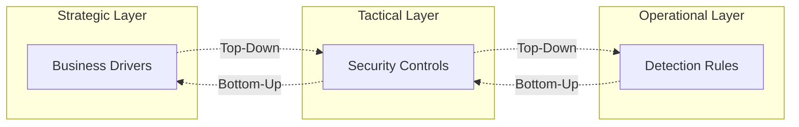
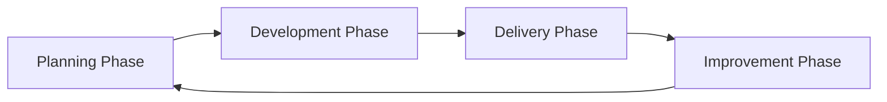
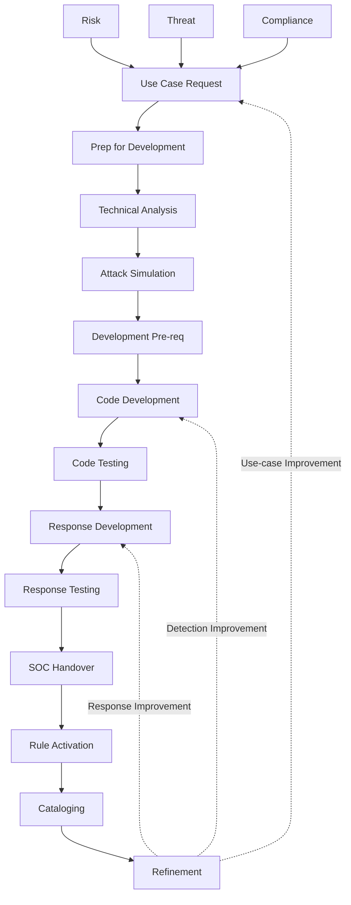

# The Detection Engineering Lifecycle

<!-- journey:where -->
*Understand the framework › The lifecycle at a glance*
<!-- /journey:where -->

The framework organizes detection work into four phases: planning,
development, delivery and improvement. Improvement feeds back into planning, so
the phases form a cycle rather than a one-way sequence. A detection passes
through the cycle once to reach production, and then returns to it repeatedly
for as long as it remains in service.

This chapter gives an overview of the whole cycle and the steps within each
phase. Each phase has its own chapter later in the guide. The chapter after
this one shows the cycle applied to a single detection from start to finish.

One principle connects all four phases: two-way traceability. It must be
possible to connect elements at the operational layer, such as individual
detection rules, to the tactical and strategic layers above them, and to trace
in the other direction as well. This allows a SOC to show how business drivers
are implemented in operational monitoring (top-down) and which threats and
business drivers each monitoring rule serves (bottom-up).

## Two-Way Traceability

Traceability works in both directions:

- **Top-down**, it shows how each business driver is put into practice in
  operational monitoring. Given a risk in the risk register, it is possible to
  list the detections that address it.
- **Bottom-up**, it shows why each detection exists. Given a rule, it is
  possible to name the threat, risk or obligation it serves, the telemetry it
  depends on, and the response it triggers.

The second direction matters most when something goes wrong. When a log
source fails or a rule is proposed for retirement, traceability shows
immediately what coverage is affected and which obligations are at stake.

---

## Lifecycle Phases

### Planning Phase

Planning establishes why a detection is needed, how urgently, and whether it
is worth building. It turns a business driver into a scoped, prioritized use
case request.

### Development Phase

Development builds the detection in three stages: confirming the telemetry is
available, designing and testing the logic, and building the response.

### Delivery Phase

Delivery hands the detection to the team that will operate it, activates it in
production, and records it in the detection catalog.

### Improvement Phase

Improvement keeps the detection accurate for as long as it is in service
through feedback, tuning and scheduled review, and eventually retires it. Its
findings flow back into planning.

---

## Detailed Framework Overview

Within the four phases the framework defines fourteen steps. Together they turn
a business need, arising from a risk, a threat or a compliance obligation, into
a detection and response that operate in production and are kept up to date.

---

## Complete Framework Steps

The dotted lines show that improvement does not always return to the start. A
change in business need returns to the use case request; a flaw in the logic
returns to code development; a gap in the response returns to response
development.

---

## Framework Phases Breakdown

### Planning Phase - Steps 1-3: Business Drivers Input and Planning

#### Step 1: Identifying Primary Drivers

Every use case must be anchored to a genuine business need that justifies the
time and resources it will consume. The first step identifies and records that
need. It comes from one or more of three drivers:

- **Risk drivers** arise from enterprise risk management, where the
  organization identifies threats to its operations, assets or reputation. They
  often come from business impact analyses that expose weaknesses in critical
  processes or systems.
- **Threat drivers** arise from intelligence about active attackers and
  campaigns against the organization or its industry: current attack patterns,
  and the tactics, techniques and procedures attackers use.
- **Compliance drivers** arise from regulations and industry standards that
  require specific controls and monitoring, such as SOX for financial
  reporting, HIPAA for health data, or PCI DSS for payment card data.

#### Step 2: Use Case Request

The drivers are translated into a specific use case request. The request links
back to its drivers and states why the detection is needed, what problem it
solves, what it should detect and in what circumstances, and how success will
be measured.

Detection engineering capacity is always limited, so requests are prioritized.
The framework scores each request against written criteria, including threat
relevance, the value of what it protects, the size of the coverage gap, and the
cost to build and maintain it, so that the most important detections are built
first and the pipeline of future work remains visible.

#### Step 3: Prep for Development

Before development begins, the environment, people and plan are put in place.
That means a development and test environment that resembles production,
access to the relevant data sources and tools, and the right mix of people:
detection engineers, threat intelligence analysts, and specialists in the
technologies and attacks involved.

---

### Development Phase - Steps 4-10: Integrating, Building and Testing

#### Step 4: Technical Analysis

Technical analysis establishes what the detection can realistically be built
on. It examines the data sources in detail: what is logged, in what format,
where it is stored, and how complete and reliable it is. This step often shows
a gap between what an organization believes it logs and what is actually
available. It also examines the constraints of the detection platform, such as
processing capacity, storage, query performance and integration.

#### Step 5: Attack Simulation

Attack simulation tests the approach against evidence before significant
effort is invested. Realistic attack scenarios, based on current threat
intelligence and the use case, are run in an isolated environment that
resembles production. The simulation shows what the attack actually produces
in the logs, and establishes a baseline that distinguishes normal activity from
malicious activity. It frequently reveals things that analysis alone would
miss.

#### Step 6: Development Pre-req

This step finalizes the technical requirements and design before any logic is
written. The findings from analysis and simulation become a specification
detailed enough to guide development: how the detection will be structured,
how it fits the existing platform, how events will be parsed and enriched, and
what its output will look like to the systems and people that consume it.

#### Step 7: Code Development

Code development turns the design into working detection logic. The logic has
to be precise enough to avoid noise and broad enough to catch variations of the
technique, with attention to time windows, correlation across data sources, and
thresholds. It is then written in the query language of the target platform
and tuned for performance, since an inefficient rule can slow the whole
platform.

#### Step 8: Code Testing

Testing confirms that the detection works under realistic conditions:

- **Unit testing** checks each part of the logic in isolation, such as parsing,
  correlation and output formatting, against known inputs.
- **Integration testing** checks how the detection interacts with other rules
  and with the platform, including conflicts and resource use.
- **Performance testing** measures processing time, memory use and platform
  impact under realistic load.

#### Step 9: Response Development

A detection is useful only if it leads to the right action in time. This step
defines how alerts are formatted, prioritized and routed, including severity
levels, escalation criteria and notifications, and produces the playbook that
guides analysts through investigation and response. A good playbook gives
clear steps, allows for variation in how attacks unfold, and includes decision
points that help analysts choose the right action.

#### Step 10: Response Testing

Response testing checks the human and procedural side of the detection. In
tabletop exercises the teams involved walk through a simulated incident, which
tests communication, decision-making and escalation as well as the technology.
Drills then exercise the full path from alert to resolution. Both regularly
expose differences between the documented procedure and what actually happens,
and show where training, process or tooling needs to change.

---

### Delivery Phase - Steps 11-13: Deployment & Operations

The delivery steps move the detection from development into production, and
make sure it can be operated and sustained by the team that inherits it.

#### Step 11: SOC Handover

Handover transfers the detection, and the knowledge behind it, from the
development team to the operating team. It includes documentation that analysts
of varying experience can use: technical detail, decision trees,
troubleshooting guidance and escalation procedures. It also includes training
that covers both the detection itself and the response procedures.

#### Step 12: Rule Activation

Activation puts the detection into production. Deployment is usually staged,
for example by running the rule without raising alerts, or enabling it for a
limited scope first, so that its behavior can be checked against real activity
before it affects the whole operation. The first weeks establish a baseline
for alert volume, alert quality and platform load, which later tuning relies
on.

#### Step 13: Cataloging

Cataloging records the detection, and the knowledge gained in building it, for
future use. The record captures not only what was built and how it works, but
why the design decisions were made, which alternatives were rejected, and what
difficulties arose. Lessons learned feed back into the team's methods, testing
procedures and training.

---

### Improvement Phase - Step 14: Refinement

#### Step 14: Refinement

Refinement begins as soon as the detection is live and continues until it is
retired. Analyst feedback, scheduled reviews, automated health checks and
incident reviews identify detections that are noisy, silent, outdated or
incomplete. Depending on the cause, the change returns to the use case request,
to code development, or to response development, as the dotted lines in the
diagram above show. A detection that no longer serves its purpose is retired
through a recorded procedure rather than simply switched off.

---

## Success Metrics

| Phase | Key Metrics | Success Indicators |
|-------|----------------|----------------------|
| **Planning** | Scope definition, resource allocation | Clear objectives, stakeholder agreement |
| **Development** | Rule quality, coverage | Tested logic, high precision |
| **Delivery** | Implementation speed, integration success | Alert volume within forecast, timely triage |
| **Improvement** | Detection health, response time | Few detections overdue for review, faster resolution |

[Detection metrics](detection-metrics.md) defines each measure precisely.

---

## In brief

- The lifecycle has four phases: planning, development, delivery and
  improvement. Improvement feeds back into planning.
- Development is split into three stages: technical feasibility, detection
  engineering and response engineering.
- Two-way traceability connects every detection to the business drivers above
  it and the telemetry below it.
- Every phase produces recorded outputs, so that the reasoning behind a
  detection survives the people who built it.

## What comes next

An overview of phases can remain abstract until it is applied to something
concrete. The next chapter follows a single detection, for consent phishing
against a cloud identity provider, through every phase of the cycle. The same
detection serves as the running example for the rest of the guide.

<!-- journey:next -->

---

**Previous:** [Why a framework is needed](Background-and-Introduction.md) · **Next:** [A detection's journey](worked-example.md)

<!-- /journey:next -->
