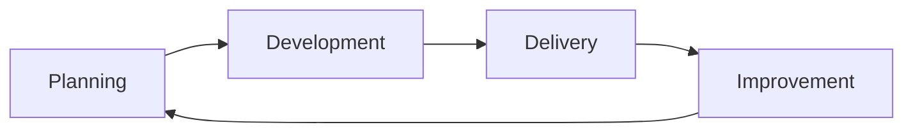

# Detection Engineering Framework

[](specification.md)
[](conformance-model.md)
[](https://github.com/Ke0xes/Detection-Engineering-Framework/actions/workflows/validate.yml)
[](https://github.com/Ke0xes/Detection-Engineering-Framework/blob/main/License)
[](https://github.com/Ke0xes/Detection-Engineering-Framework/stargazers)

The Detection Engineering Framework is an open, vendor-neutral method for
building, running and retiring security detections. It follows each detection
from the business reason it exists, through the telemetry and logic behind it
and the response it triggers, to the day it is reviewed, tuned or
decommissioned.

It is written for detection engineers and SOC leads. Security leaders will find
a shorter path through it below.

The framework is available as a
[documentation site](https://ke0xes.github.io/Detection-Engineering-Framework/)
and as this repository.

---

## The problem it addresses

Consider a detection engineer joining a mature security operations center. The
SIEM holds four hundred rules. Some fire hundreds of times a day and are
routinely closed without investigation. Others have not fired in two years, and
nobody knows whether that means the threat is absent or the rule is broken. A
few were written for an audit, some after an incident, many for reasons no one
recorded. When the endpoint telemetry pipeline fails for six hours, nobody can
say which of those four hundred rules went blind.

None of this is unusual, and none of it results from poor engineering. It
results from treating detections as individual pieces of logic rather than as
assets with a purpose, dependencies, an owner and a lifespan.

The framework gives each detection those properties. Every detection is traced
to a recorded business driver (a risk, a threat or a compliance obligation), to
the telemetry it relies on, and to the response it initiates. It is tested
before release, measured in production, reviewed on a schedule, and retired
deliberately when it no longer earns its place.

---

## How the framework works

The framework organizes detection work into four phases that repeat as a cycle.



- **Planning** establishes why a detection is needed, how urgently, and whether
  it is worth building. Requests are prioritized with a scoring rubric whose
  levels are described in writing, so that two people scoring the same request
  reach the same answer.
- **Development** happens in three stages. The first confirms that the necessary
  telemetry exists and behaves as expected. The second designs and tests the
  detection logic. The third builds the response that follows when the detection
  fires.
- **Delivery** hands the detection to the team that will operate it, forecasts
  its alert volume, and releases it in stages.
- **Improvement** keeps it healthy: analyst feedback, scheduled review, tuning,
  drift detection, and eventually retirement.

One principle connects the phases: **two-way traceability**. From any business
driver it should be possible to list the detections that serve it, and from any
detection it should be possible to name the drivers, telemetry and response
behind it.

---

## What the framework contains

The framework has three parts, intended to be used together.

1. **The guide.** Chapters that walk through each phase, explain the reasoning
   behind it, and follow one detection from start to finish as a running
   example.
2. **The specification.** The same practices stated as testable requirements,
   grouped into three conformance levels. Level 1 is achievable by a small team
   with no tooling budget; Level 3 describes a program that measures and
   corrects itself.
3. **The tools.** Machine-readable schemas for detection and use case records, a
   reference implementation with validation and tests, templates for intake
   forms, and a self-assessment instrument.

---

## Where to start

| Reader | Suggested path |
| --- | --- |
| **Detection engineer** | [The lifecycle at a glance](Detection-Engineering-Lifecycle.md), then [A detection's journey](worked-example.md), then the phase chapters in order |
| **SOC lead** | [Why a framework is needed](Background-and-Introduction.md), [A detection's journey](worked-example.md), [The planning phase](planning-phase.md) and [The improvement phase](improvement-phase.md) |
| **Security leader** | This page, [A detection's journey](worked-example.md), [Assessing a program](conformance-model.md) and [Related work](related-work.md). Each chapter closes with an *In brief* summary for readers who need the conclusions rather than the method |
| **Small team with no budget** | [Adopting the framework](from-theory-to-practice.md), which covers a minimal starting point and how to grow from it |
| **Assessor or auditor** | [Assessing a program](conformance-model.md) and [The specification](specification.md) |

Readers who prefer to follow the full path can start with
[Why a framework is needed](Background-and-Introduction.md) and use the
*Next* link at the foot of each chapter.

---

## See it working

The repository includes a complete reference implementation. It contains one
detection, for malicious OAuth application consent in Microsoft Entra ID,
carried through every phase: the original request, the detection record,
portable and platform-specific rule logic, test data, a response playbook and
production metrics. The same detection is the running example throughout the
guide.

Two scripts check that example against the framework. The first validates the
records against the schemas and the specification. The second runs the
detection logic against its test data.

```bash
git clone https://github.com/Ke0xes/Detection-Engineering-Framework.git
cd Detection-Engineering-Framework
pip install -r reference-implementation/tools/requirements.txt

python reference-implementation/tools/def_validate.py --strict
python reference-implementation/tools/def_test.py
```

Both report success on the unmodified repository. The checks become more
instructive once something is changed. Each edit below, made to
`reference-implementation/detections/DET-2026-0001.yml`, causes validation to
fail with the requirement that was breached:

| Change | Reported failure |
| --- | --- |
| Move `last_reviewed` back six months | The detection is overdue for review (`IMP-9`) |
| Set an exception's `expires` date in the past | The exception has expired (`IMP-6`) |
| Set `review_cadence_days: 180` | Detections with exceptions must be reviewed every 90 days (`IMP-8`) |
| Set `precision_30d: 0.4` | Precision is below the tuning threshold (`MET-2`) |
| Point `use_case_ref` at a request that does not exist | The detection cannot be traced to a business driver (`TRACE`) |

The same checks run in continuous integration on every change to this
repository, and can be adopted in any detection repository. The
[reference implementation guide](reference-implementation/README.md) explains
how.

### Use it with an AI assistant

The repository also includes an
[AI agent skill](skills/senior-detection-engineer/README.md) that makes an
assistant such as GitHub Copilot or Claude act as a senior detection engineer
working to this framework. It scores requests, designs and reviews rules,
writes detection records, fixtures and playbooks, and assesses conformance.
The skill is self-contained and can be copied into any project.

---

## How it relates to other work

The framework builds on established work rather than replacing it. MITRE ATT&CK
and ATLAS provide the vocabulary for adversary behavior, Sigma provides portable
rule syntax, and MITRE's Summiting the Pyramid research informs how detection
robustness is assessed.

Three things distinguish it:

- **Traceability is required, not recommended.** Every detection must link to a
  business driver and to its telemetry in a machine-readable form.
- **Response is part of the detection.** A detection is not complete until the
  response it triggers has been designed and rehearsed.
- **Detection intent is recorded independently of any platform.** Vendor
  Agnostic Logic (VAL) states what a detection is looking for before it is
  written in a particular query language, so the same intent can be implemented
  and tested on several platforms.

[Related work](related-work.md) sets out the comparison in detail.

---

## Contributing

The most useful contribution is an account of what happened when a team adopted
part of the framework, particularly where something proved impractical.
Requirements that cannot be met in practice are defects in the specification.
Implementation reports can be filed as an
[issue](https://github.com/Ke0xes/Detection-Engineering-Framework/issues/new?template=implementation-report.yml).

Other contributions are also welcome, notably a second worked example on a
non-identity surface, platform backends for the test runner, and mappings to
compliance frameworks. [CONTRIBUTING.md](CONTRIBUTING.md),
[ROADMAP.md](ROADMAP.md) and [GOVERNANCE.md](GOVERNANCE.md) describe how the
project is run. The project currently has one maintainer, and GOVERNANCE.md
describes the intended path to broader, neutral governance.

## License

The entire repository is licensed under the
[Apache License 2.0](https://github.com/Ke0xes/Detection-Engineering-Framework/blob/main/License).
Attribution requirements are in
[NOTICE](https://github.com/Ke0xes/Detection-Engineering-Framework/blob/main/NOTICE).

## Citing

> Hatode, K. et al. *Detection Engineering Framework*, version 2.1.1, 2026.
> https://github.com/Ke0xes/Detection-Engineering-Framework

Machine-readable citation metadata is in
[CITATION.cff](https://github.com/Ke0xes/Detection-Engineering-Framework/blob/main/CITATION.cff).

## Credits

Created by **[Kunal Hatode](https://kunal.hatode.com)**, originally developed
during work as a Cyber Operations Security Architect at Cisco and published
independently.

With thanks to:

- **[Frank Hassenrueck](https://www.linkedin.com/in/frank-hassenr%C3%BCck-371529116/)**, who co-wrote technical core elements
- **[Matrix Chau](https://www.linkedin.com/in/matrixchau/)**, who provided early feedback and co-wrote parts of the framework

The ideas assembled here draw on the wider security community. The framework's
own contribution is the lifecycle, the conformance model, the schemas and their
enforcement; the underlying understanding of adversary behavior belongs to
MITRE, SigmaHQ and the practitioners who publish their methods.

<!-- journey:next -->
<div class="journey-footer" markdown>

---

**Next:** [Why a framework is needed](Background-and-Introduction.md)

</div>
<!-- /journey:next -->
