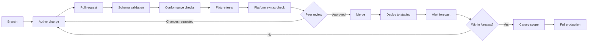

# Detection as Code

*[Framework index](README.md) · [Specification](specification.md) · [Conformance](conformance-model.md)*

> **Normative status.** This chapter is normative. Requirement identifiers of the
> form `DAC-n` are testable conformance criteria.

Detection as code is not "we keep our rules in Git." It is the application of
software engineering controls to detection content: version control, peer
review, automated testing, and deployment from a reviewed source of truth.

A working reference implementation of everything in this chapter is in
[`reference-implementation/`](https://github.com/Ke0xes/Detection-Engineering-Framework/tree/main/reference-implementation).
It runs.

---

## Why it matters

A detection is a production control. Changing one changes what the organization
can see. Yet in most programs a detection can be edited directly in a console by
one person, with no review, no test, no record of what it looked like before,
and no way to restore it.

No competent organization would accept that for a firewall rule. Detection
content is treated more casually largely because the tooling made it easy to be
casual.

---

## Requirements

**DAC-1.** Detection logic and detection metadata MUST be version-controlled.

**DAC-2.** Changes MUST be made through pull requests. Direct commits to the
default branch MUST be prevented by branch protection.

**DAC-3.** At least one reviewer other than the author MUST approve. High
severity detections SHOULD require two.

**DAC-4.** Automated validation MUST gate merge. At minimum: schema
conformance, the framework conformance checks, and syntax validation for each
target platform.

**DAC-5.** Fixture tests MUST gate merge. A change that breaks a detection's
true-positive fixture MUST NOT be mergeable.

**DAC-6.** Deployment to production MUST be automated from the reviewed source.
Manual copy-paste into a console MUST NOT be the deployment mechanism.

**DAC-7.** Divergence between the repository and the production platform MUST
be detected and reconciled on a defined cadence. Out-of-band changes happen;
undetected out-of-band changes are what make the repository untrustworthy.

**DAC-8.** Rollback MUST be achievable by reverting a commit and re-running the
deployment, without manual reconstruction of prior state.

---

## Repository layout

The reference layout, which the tooling assumes:

```text
detection-repo/
├── schema/                      Contracts. Copied unchanged from the framework.
├── use-cases/                   Planning artifacts, one file per request
├── detections/                  Metadata, one file per detection, named by ID
├── rules/
│   ├── sigma/                   Portable logic
│   ├── kql/                     Platform implementations
│   └── spl/
├── fixtures/<DETECTION-ID>/     Telemetry samples asserting behavior
├── playbooks/                   Response content, versioned with the detections
├── tools/                       Validation, test and deployment scripts
└── .github/workflows/           The gates
```

Two properties matter more than the exact shape:

1. **Metadata is separate from logic.** One metadata file may reference several
   platform implementations. This is what makes the VAL concept operational
   rather than theoretical.
2. **Fixtures live with the detection, not in a separate test project.** Tests
   that are inconvenient to find are tests that do not get updated.

---

## The pipeline



### Gate 1: schema validation

Does the metadata conform to the contract? This catches missing owners, absent
review cadences, malformed ATT&CK references and unparsable dates. It is cheap
and it runs in under a second.

### Gate 2: framework conformance

The checks a schema cannot express. The reference implementation enforces:
traceability references resolve, priority scores match the rubric, exceptions
have not expired, review dates have not passed, required log sources declare a
liveness interval, precision is reported and above threshold.

This is the gate that makes detection debt *visible*. A detection past its
review date fails the build. That is uncomfortable, and it is the point: debt
that does not hurt does not get paid.

### Gate 3: fixture tests

Does the logic still do what it claims? Every detection asserts what it must
match and what it must not match. The most valuable fixtures are the negative
ones, because tuning pressure only ever pushes in one direction.

### Gate 4: platform syntax

Will it actually deploy? Validate against each target platform's parser before
merge, not at deployment time.

### Gate 5: peer review

What automation cannot judge: is the hypothesis sound, is the exception scoped
correctly, is the triage guidance usable at three in the morning, is the
robustness tier honest?

---

## Pull request review checklist

Reviewers SHOULD confirm each of the following. This list is deliberately short
enough to be used.

- [ ] The hypothesis is stated and the logic tests it
- [ ] Traceability to a business driver is present and correct
- [ ] Severity, confidence and robustness tier are honest, not aspirational
- [ ] Alert disposition is appropriate; this does not need to be an alert if it
      is better as correlation or enrichment
- [ ] Known benign causes are documented with triage guidance
- [ ] Any exception is narrowly scoped, justified, owned and has an expiry
- [ ] A true-positive and a true-negative fixture exist and are meaningful
- [ ] Query cost is acceptable at production data volume
- [ ] The response playbook exists and matches what this detection actually
      indicates
- [ ] For a change: the reason is recorded and classified (`IMP-4`)

---

## Deployment

**Staging first.** Deploy to a non-production workspace and execute against
historical data to produce the alert forecast required by `DEL-2`.

**Canary next.** Enable for a limited scope: one business unit, one site, one
subset of identities. Observe against the forecast. The reference criteria for
promotion:

| Criterion | Threshold |
| --- | --- |
| Alert volume | Within 2x of forecast |
| Precision over the canary window | Above the level threshold |
| Query execution time | Within platform budget |
| No platform degradation | No breach of ingest or search SLOs |

**Full production last.** Promote only when canary criteria are met.

**Rollback** is `git revert` plus a pipeline run. If rollback requires a human
to remember the previous state, `DAC-8` is not met.

---

## Drift reconciliation

**DAC-7** exists because consoles allow editing and people are under pressure.

Implement a scheduled job that reads deployed detection content from each
platform's API and diffs it against the repository. Any difference is either:

- an unauthorised change, which is a security control integrity issue, or
- a legitimate emergency change that was never back-ported, which is a process
  issue.

Both require action. Neither is discovered without the job.

---

## Crawl, walk, run

Do not build this on day one. The order that works:

| Stage | Do this | Do not yet |
| --- | --- | --- |
| **Crawl** | Put metadata and logic in Git. Review changes by pull request, even manually. | Build a pipeline |
| **Walk** | Add schema validation and conformance checks in CI. Add fixtures for your ten noisiest detections. | Automate deployment |
| **Run** | Automate deployment, add drift reconciliation, add scheduled adversary emulation. | — |

A team that reaches "walk" has most of the benefit. The pipeline is the last
20%, not the first.

---

*Next: [Telemetry and Data](telemetry-and-data.md) · Previous: [Conformance Model](conformance-model.md)*
