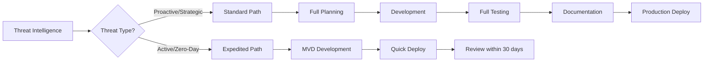

# Adopting the Framework

<!-- journey:where -->
*Put it into practice › Adopting the framework*
<!-- /journey:where -->

The lifecycle chapters describe the framework as it works in a well-resourced
program. Most organizations do not start there. Teams are small, data is
incomplete, tooling budgets are limited, and active threats do not wait for a
planning cycle to finish. A framework adopted without regard to these
conditions can slow a team down rather than help it.

This chapter examines four ways adoption commonly goes wrong and how to avoid
each: treating the process as rigid, assuming a level of maturity the
organization does not yet have, neglecting the improvement phase, and relying
on manual testing. For each it describes the problem, its consequence, and
practical mitigations, including an expedited path for active threats and a
staged, crawl-walk-run approach to building capability.

---

## Issue 1: The Trap of Rigidity and "Analysis Paralysis"

The lifecycle's structure is what makes detections consistent and defensible.
Applied rigidly to every detection, the same structure prevents a team from
responding quickly.

### The Problem

A zero-day exploit or a fast-moving campaign cannot wait for a planning and
development cycle measured in weeks. Applied without exception, the process
becomes an obstacle rather than a support, and the pursuit of a complete,
fully documented detection delays the simple one that is needed now.

### The Consequence

The SOC cannot see an active threat while the engineering team completes the
procedure. Time to detect novel threats grows at exactly the moment it matters
most.

### Mitigation Strategies

#### 1. Implement a Two-Tiered Detection Pipeline

- **Standard path.** Proactive, intelligence-driven detections follow the full
  lifecycle. This path builds the long-term detection portfolio.
- **Expedited path.** Active threats, zero-days and critical new techniques
  follow a shortened process that produces a Minimum Viable Detection (MVD).
  The detection is deployed quickly, on the understanding that it will be
  brought up to the standard, or withdrawn, once the immediate threat has
  passed. The [specification](specification.md#13-the-expedited-path) defines
  who may invoke the path and how its use is reported.

#### 2. Embrace Agile Principles

- **Timebox the work.** Detection development runs in short sprints, typically
  one to two weeks, and each sprint produces a working detection, even a
  simple one.
- **Reprioritize continually.** The backlog is re-evaluated as threats emerge,
  using the [planning rubric](planning-phase.md#priority-management).

#### 3. Mandate the "Minimum Viable Detection" (MVD) Concept

The MVD is the smallest set of artifacts acceptable for production: a recorded
hypothesis, one true-positive fixture, a named owner, a response instruction,
and a review date no more than 30 days away. At that review, the detection is
brought to full conformance or withdrawn. Defining the minimum prevents both
unreviewed shortcuts and unnecessary polish under time pressure.

---

## Issue 2: The Assumption of High Organizational Maturity

The lifecycle is described in terms of a program with dedicated roles, good
data and an integrated toolchain. Many organizations have none of these yet.

### The Problem

The lifecycle refers to distinct roles, such as threat intelligence analyst,
detection engineer, SOC analyst and data engineer; to clean, complete data
sources; and to a toolchain with version control, CI/CD and platform APIs. In
practice, individuals often cover several roles, data is incomplete, and
budgets for new tools are small.

### The Consequence

Teams that try to adopt the whole framework at once, without those
foundations, tend to fail. The result is frustration, burnout, and a belief
that good detection engineering is out of reach for them.

### Mitigation Strategies

#### 1. Adopt a Crawl-Walk-Run Approach

- **Crawl.** Start with the basics rather than a CI/CD pipeline. Write
  detection logic in a shared document with manual peer review, and focus on
  one high-value data source, such as EDR or Windows security events.
- **Walk.** Move detections into version control with Git, write basic
  scripts to test them, and document playbooks in a simple wiki.
- **Run.** Implement full detection as code, with automated testing, automated
  deployment and established feedback loops. [Detection as
  code](detection-as-code.md) describes the target state.

#### 2. Justify Investment with Data

The framework's own methods make the case for resources. A gap analysis
against MITRE ATT&CK shows leadership exactly which threat behaviors the
organization cannot see. Each request for a new data source or tool is then
framed as the remedy for a specific, quantified risk.

#### 3. Leverage Open-Source and Existing Tools Aggressively

Where a new SIEM is not affordable, make full use of the existing one.
Open-source tools cover much of the rest: Sigma for portable rule logic,
Atomic Red Team for testing, and a Git repository for version control.

---

## Issue 3: The Vague and Under-Defined "Improvement Phase"

The [improvement phase](improvement-phase.md) defines concrete mechanisms, but
it is still the phase most easily neglected, because it competes for time with
new detection work.

### The Problem

"Gathering feedback" is not a process. Without a required mechanism, feedback
from the SOC to the engineering team is inconsistent, anecdotal and easily
ignored. Without measurement, "improvement" is a matter of opinion.

### The Consequence

The feedback loop breaks. False positives persist, alert fatigue wears down the
SOC, and the same problematic detections fire for months or years. The
detection portfolio becomes stale and untrusted.

### Mitigation Strategies

#### 1. Formalize the Feedback Mechanism

- Add required fields to the incident ticket for the detection's disposition
  (true positive or false positive), a tuning recommendation, and the clarity
  of the playbook.
- Treat an alert as not closed until that feedback has reached the
  engineering backlog.

#### 2. Define and Track Ruthless Metrics

| Metric | Description | Action threshold |
| --- | --- | --- |
| **Precision** | Share of a detection's alerts confirmed as genuine, over 30 days | Below 0.50 enters the tuning backlog |
| **Mean Time to Tune (MTTT)** | Feedback submission to tuned rule in production | Target under 7 days |
| **Detection efficacy** | Share of purple team tests the detection catches | Target above 85% |
| **SOC acknowledgment rate** | Share of alerts analysts acknowledge | Below 70% indicates analysts are ignoring the detection |

[Detection metrics](detection-metrics.md) defines these measures and the
thresholds at each conformance level.

#### 3. Schedule Mandatory Detection Reviews

A quarterly detection portfolio review examines every detection for
performance, relevance and alignment with the current threat landscape.
Detections that no longer earn their place, or are too noisy to fix, are
formally retired.

---

## Issue 4: Insufficient Emphasis on Proactive, Automated Validation

Testing at release shows that a detection worked once. It does not show that
the detection still works.

### The Problem

A detection that works in the lab can fail silently in production because of a
small change in the environment, a log source failure, or a variation in the
attacker's technique. Manual testing does not scale to catch this detection
drift.

### The Consequence

The organization believes it has coverage when key detections are broken, and
discovers the fact only after a major incident.

### Mitigation Strategies

#### 1. Integrate Adversary Emulation into the Lifecycle

- **During development.** No detection is approved until it has been tested
  against a corresponding emulation, such as an
  [Atomic Red Team](https://github.com/redcanaryco/atomic-red-team) test.
- **In production.** Key detections are tested automatically on a schedule,
  using a scheduled script or a breach and attack simulation platform. A
  detection that fails to fire raises an alert.

#### 2. Establish a Formal Purple Teaming Cadence

Red and blue teams meet regularly to emulate techniques together and improve
detections as they go. Purple teaming finds gaps that automated tests miss,
because the people running it can vary the technique in response to what they
see.

#### 3. Treat "Detection Health" as a Critical Metric

A dashboard shows the status of every production detection, based on its last
automated test. A detection whose test is stale or failing is treated as a
high-priority defect.

---

## Quick Reference

| Challenge | Solution | Success metric |
| --- | --- | --- |
| Analysis paralysis | Two-tiered pipeline | Expedited deployments within 24 hours |
| Resource constraints | Crawl-walk-run approach | Incremental capability growth |
| Poor feedback loops | Formalized mechanisms | Precision above 0.50, MTTT under 7 days |
| Detection drift | Automated validation | Over 85% of purple team tests detected |

---

## In brief

- The framework is a model to adapt, not a procedure to follow step by step.
  The right starting point depends on the team's size, data and tooling.
- Active threats take an expedited path. A minimum viable detection is
  deployed quickly and brought to full conformance within 30 days.
- Capability grows in stages: consistent records first, then automated
  validation, then automated deployment.
- Improvement needs explicit mechanisms, and validation needs to be automated
  and continuous rather than a one-off test at release.

## What comes next

The next chapter, [advanced practices](best-practices.md), collects practices
for programs that are already operating the lifecycle and want to strengthen
it, from detection councils and debt management to staged rollouts and
feedback loops.

<!-- journey:next -->

---

**Previous:** [Going deeper: Detection metrics](detection-metrics.md) · **Next:** [Advanced practices](best-practices.md)

<!-- /journey:next -->
