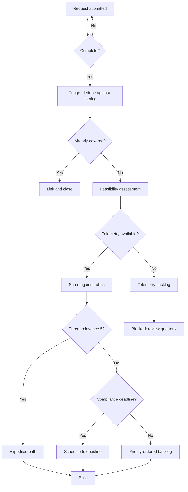

# Governance and Roles

<!-- journey:where -->
*Walk the lifecycle › Planning › Going deeper*
<!-- /journey:where -->

The planning phase describes how requests are captured, scored and ranked. This
chapter describes who does that work and who has the authority to decide. In
practice, detection programs fail more often through organizational design
than through technique: the logic may be sound, but no one owns the outcome,
priorities are set by whoever raised them most recently, and analysts who
consume the alerts have no formal route to influence the engineers who write
them.

> **Running example.** The consent phishing request was scored and accepted by
> the detection council, the cross-functional body described below, which also
> approved the one exception later added to the detection.

The sections below cover the functions a detection program needs, how
accountability is divided among them, how requests move from intake to
backlog, and how capacity and service levels are set.

---

## Roles

These are **functions, not headcount**. In a three-person team one person holds
several. The point of naming them is that the *work* must be assigned, not that
the *titles* must exist.

### Detection Engineer

Builds and maintains detection logic and metadata.

- Translates a use case into a hypothesis and a VAL
- Writes logic, fixtures and exceptions
- Performs peer review
- Owns robustness tier accuracy

Fails when: treated as a rule-writing service desk with no input into
prioritization.

### Detection Content Manager

Owns the catalog as a whole rather than individual detections.

- Backlog grooming and rubric scoring consistency
- Detection debt tracking and review scheduling
- Coverage model and gap reporting
- Deprecation proposals

Fails when: absent. This is the most commonly unassigned role, and its absence
is why catalogs grow without ever shrinking.

### Threat Intelligence Analyst

Supplies and maintains the threat relevance input.

- Maintains the prioritized adversary and technique profile
- Provides the evidence behind `threat_relevance` scores
- Triggers review when tracked adversaries change tradecraft

Fails when: producing reports nobody converts into detection requirements.

### Data / Telemetry Engineer

Owns the substrate.

- Log source onboarding, normalization and retention
- Data quality scoring (`TEL-4`) and liveness monitoring (`TEL-5`)
- Cost attribution (`TEL-6`)

Fails when: reporting into infrastructure with no security-driven priorities,
so detection telemetry requests queue behind capacity work indefinitely.

### SOC Analyst

The customer. Not a passive recipient.

- Dispositions every alert (`IMP-2`)
- Provides the evidence behind precision
- Identifies missing context and unusable playbooks

Fails when: disposition is optional. The entire improvement phase depends on
this one input.

### Incident Responder

- Owns response playbook content
- Runs retrospectives that produce T4 improvement triggers
- Defines containment authority (`RSP-3`)

### Detection Council

The decision authority (`GOV-6`, `GOV-7`).

- Resolves prioritization disputes on evidence rather than seniority
- Approves deprecations and exceptions above threshold
- Owns the conformance trajectory
- Reviews expedited path usage (`GOV-15`)

Fails when: it becomes a status meeting. It exists to make decisions that are
otherwise made badly by default.

---

## RACI

**GOV-8** requires a documented RACI. This is the reference model; adapt the
column headings to your structure, but every row must have exactly one `A`.

| Activity | Det. Eng | Content Mgr | Threat Intel | Data Eng | SOC | IR | Council | Business |
| --- | --- | --- | --- | --- | --- | --- | --- | --- |
| Submit use case request | C | C | R | I | C | C | I | **A/R** |
| Score against rubric | C | **R** | C | I | C | I | **A** | I |
| Feasibility assessment | **R** | C | I | **R** | I | I | **A** | I |
| Accept or reject request | C | C | C | C | C | C | **A/R** | C |
| Build detection logic | **A/R** | C | C | C | I | I | I | I |
| Peer review | **R** | C | C | I | C | I | **A** | I |
| Build response playbook | C | I | I | I | C | **A/R** | I | I |
| Approve for production | C | **R** | I | I | **C** | C | **A** | I |
| Activate in production | **A/R** | I | I | I | C | I | I | I |
| Disposition alerts | I | I | I | I | **A/R** | C | I | I |
| Tune (C1-C3) | **A/R** | C | I | C | C | I | I | I |
| Rebuild (C4-C5) | **R** | C | C | C | C | C | **A** | I |
| Scheduled review | **R** | **A** | C | C | C | C | I | I |
| Deprecate | C | **R** | C | I | C | C | **A** | C |
| Report metrics | C | **A/R** | I | C | C | I | I | I |
| Own log source quality | C | I | I | **A/R** | I | I | I | I |

**The two rows that decide whether the program works** are *Disposition alerts*
and *Scheduled review*. If the SOC is not accountable for the first and the
content manager is not accountable for the second, the improvement phase has no
inputs and no owner, and everything else degrades from there.

---

## Intake workflow

**The deduplication step at C is the highest-value and most-skipped step.** Most
mature catalogs contain multiple near-identical detections built by different
people at different times, each with its own exceptions and its own maintenance
cost.

---

## Capacity

A backlog without a capacity model produces commitments nobody can meet.

| Allocation | Purpose |
| --- | --- |
| 40-50% | New detection development |
| 20-30% | Improvement and detection debt (`IMP-10`) |
| 10-15% | Validation and adversary emulation |
| 10-15% | Platform, tooling and pipeline |
| 5-10% | Expedited path reserve |

**IMP-10** makes the improvement allocation protected rather than nominal.
Unprotected improvement capacity is consumed by build requests in every sprint,
because build requests have requesters and improvement work does not.

The expedited reserve exists because the alternative to reserved capacity is
that every urgent request displaces planned work and the roadmap becomes
fiction.

---

## Service levels

**GOV-16.** A conforming program at L2 MUST publish service levels to consuming
teams. Reference targets:

| Service | Target |
| --- | --- |
| Acknowledge a use case request | 5 working days |
| Complete feasibility assessment | 15 working days |
| Deliver a critical-priority detection | 20 working days from acceptance |
| Expedited path deployment | 24 hours from invocation |
| Tune a detection breaching precision threshold | 7 days (L2), 3 days (L3) |
| Respond to a telemetry outage notification | 1 working day |

SLAs create the accountability that turns detection engineering from a queue
into a service. They also create the evidence needed to argue for headcount:
consistently missed SLAs with a documented backlog is a capacity argument that
leadership can act on.

---

## Anti-patterns

| Anti-pattern | Consequence |
| --- | --- |
| Detection engineering reporting into the SOC | Improvement work is always deprioritized for shift coverage |
| No content manager | Catalog grows monotonically; debt is invisible |
| Council as status meeting | Decisions revert to loudest-voice default |
| Analysts have no formal feedback route | The improvement phase starves |
| Threat intel disconnected from the backlog | Threat relevance scores become guesses |
| Telemetry owned entirely outside security | Every `FEA-1` gate becomes a negotiation |
| One person owns everything | Works until they leave, then nothing is recoverable |

---

## In brief

- Detection work needs defined functions: engineering, content management,
  threat intelligence, telemetry engineering, analysis and incident response.
  In a small team, one person may hold several.
- A detection council, with representation beyond the SOC, is the decision
  authority for prioritization disputes, exceptions and deprecation.
- Every lifecycle activity has exactly one accountable party, recorded in a
  RACI.
- Improvement work needs protected capacity, or it is displaced by new build
  requests.

## Requirements in this chapter

`GOV-16` is set out above. The related governance requirements, `GOV-5` to
`GOV-8` for ownership, the council and the RACI, are in the
[specification](specification.md#32-accountability).

## What comes next

With a request accepted and owners assigned, the lifecycle moves into
development. [The technical feasibility phase](development-phase-A.md) is the
first of its three stages, and establishes whether the organization can
actually observe the activity the detection is meant to find.

<!-- journey:next -->

---

**Previous:** [The planning phase](planning-phase.md) · **Next:** [The technical feasibility phase](development-phase-A.md)

<!-- /journey:next -->
