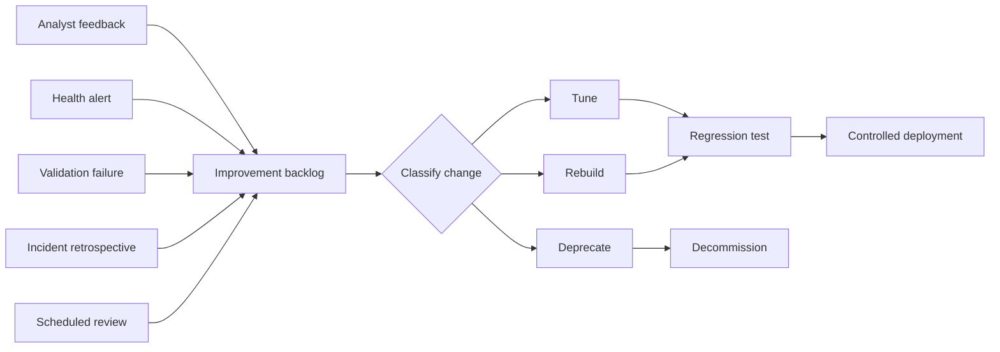

# Improvement Phase

*[Framework index](README.md) · [Specification](specification.md) · [Conformance](conformance-model.md)*

> **Normative status.** This chapter is normative. Requirement identifiers of the
> form `IMP-n` are testable conformance criteria.

The improvement phase governs every change to a detection after it enters
production, up to and including its retirement. It is the phase most programs
neglect, and neglect here is what turns a detection catalog into a liability:
rules nobody trusts, firing for reasons nobody remembers, that no analyst reads.

"Gather feedback and tune regularly" is not a process. This chapter defines the
mechanisms that make improvement happen whether or not anyone feels like doing
it.

---

## Triggers

A detection enters the improvement backlog through exactly one of five defined
triggers. **IMP-1.** Every backlog item MUST record which trigger created it.

| Trigger | Source | Detection |
| --- | --- | --- |
| **T1 Analyst feedback** | SOC disposition data | Precision below threshold, or explicit tuning request |
| **T2 Automated health alert** | Monitoring | Detection silence, log source gap, or performance breach |
| **T3 Validation failure** | Adversary emulation | A previously passing test now fails (detection drift) |
| **T4 Incident retrospective** | Post-incident review | A detection should have fired and did not, or fired with insufficient context |
| **T5 Scheduled review** | Calendar | The detection reached its review date |

Triggers T1 to T4 are reactive. T5 is the safety net that catches what the other
four miss.

---

## Closing the feedback loop

The single most common failure in detection engineering is that SOC analysts
know a rule is bad and the engineering team never finds out. Goodwill does not
close this loop. Workflow does.

**IMP-2.** An alert MUST NOT be closable in the case management system without a
recorded detection disposition. The disposition field MUST offer at minimum:

| Disposition | Meaning |
| --- | --- |
| `true-positive` | Genuine malicious or policy-violating activity |
| `true-positive-benign` | The activity occurred as described but was authorized |
| `false-positive-logic` | The detection logic is wrong |
| `false-positive-data` | The logic is right; the telemetry was wrong, missing or malformed |
| `insufficient-context` | Could not disposition from the alert; required manual pivoting |

The distinction between `false-positive-logic` and `false-positive-data` matters
because they route to different owners. Logic problems go to detection
engineering. Data problems go to the telemetry owner. Collapsing them into one
bucket is why so many tuning efforts fail: the team edits a rule that was never
the problem.

**IMP-3.** A disposition of `false-positive-logic`, `false-positive-data` or
`insufficient-context` MUST automatically create an improvement backlog item
referencing the detection ID. It MUST NOT depend on an analyst choosing to
raise one.

---

## Change classification

Not all improvements are equal. **IMP-4.** Every improvement MUST be classified
before work begins, because classification determines the required testing and
approval.

| Class | Description | Testing required | Approval |
| --- | --- | --- | --- |
| **C1 Exception** | Add or remove a specific exclusion | Regression test; confirm exception is scoped and time-bound | Peer review |
| **C2 Threshold** | Adjust a numeric threshold, window or baseline | Regression test plus backtest over 30 days of historical data | Peer review |
| **C3 Enrichment** | Add context to the alert without changing trigger logic | Verify enrichment resolves; confirm no performance regression | Peer review |
| **C4 Logic** | Change the conditions under which the detection fires | Full validation suite; adversary emulation re-run | Two reviewers; detection owner sign-off |
| **C5 Rebuild** | Replace the detection approach entirely | Treated as a new detection; full lifecycle | As for a new detection |
| **C6 Deprecation** | Retire the detection | Coverage impact assessment | Detection council |

### Exceptions are technical debt

Exceptions are the most abused improvement class because they are the fastest.
They are also the primary mechanism by which detections silently die: a rule
with forty accumulated exclusions is not a detection, it is a monument.

**IMP-5.** Every exception MUST record a justification, an owner and an expiry
date. Exceptions MUST NOT be created without an expiry date.

**IMP-6.** Expired exceptions MUST be reviewed and either renewed with fresh
justification or removed. Automatic silent renewal MUST NOT occur.

**IMP-7.** A detection whose exception count exceeds the program threshold
(default: 10) MUST be escalated for C5 rebuild assessment rather than receiving
further exceptions. Persistent need for exclusions is evidence that the
detection logic is modeling the wrong thing.

---

## Review cadence

**IMP-8.** Every detection MUST carry a `review_cadence_days` and a
`last_reviewed` date in its metadata (see
[the detection schema](https://github.com/Ke0xes/Detection-Engineering-Framework/blob/main/schema/detection.schema.json)).
A detection past its review date is in **detection debt**.

| Detection severity | Maximum review interval |
| --- | --- |
| Critical | 90 days |
| High | 180 days |
| Medium | 365 days |
| Low / informational | 365 days |
| Any detection with an open exception | 90 days regardless of severity |

**IMP-9.** The proportion of detections in detection debt MUST be reported
monthly. A conforming program at L3 maintains detection debt below 15% of the
active catalog.

**IMP-10.** A conforming program MUST allocate explicit, protected engineering
capacity to improvement work. The framework's recommendation is 20-30% of
detection engineering capacity. Improvement capacity that is not protected will
be consumed by new build requests in every sprint, without exception.

### What a review must cover

A scheduled review is not a glance at the rule. **IMP-11.** A review MUST assess
and record each of:

1. **Relevance.** Is the threat still credible against this organization?
   Re-score threat relevance using the [planning rubric](planning-phase.md).
2. **Efficacy.** Does the detection still fire on the technique? Evidence MUST
   be a validation test result, not an opinion.
3. **Precision.** Is 30-day precision above threshold? See
   [Detection Metrics](detection-metrics.md).
4. **Robustness.** Has the detection drifted down the robustness ladder because
   of exceptions or environmental change? See
   [Detection Robustness](detection-robustness.md).
5. **Telemetry.** Are all required log sources still live, complete and
   correctly parsed?
6. **Response.** Is the linked playbook still accurate, and did analysts
   actually use it?
7. **Cost.** Is query cost, ingest cost and analyst handling cost still
   proportionate to the risk addressed?

A review that does not produce a recorded decision against all seven points has
not happened.

---

## Detection drift

Detection drift is the silent degradation of a detection that still exists,
still appears healthy in the console, and no longer works. It is the dominant
cause of false confidence in mature programs.

Common causes:

| Cause | Example |
| --- | --- |
| Schema change | A vendor renames a field in an agent update; the rule now matches nothing |
| Parser change | A log source is re-onboarded through a different pipeline with different normalization |
| Volume-based sampling | Ingest cost controls begin sampling the source the detection depends on |
| Environmental change | The monitored application is migrated to a platform that emits different telemetry |
| Exception accumulation | Exclusions have grown to cover the attack path itself |
| Technique evolution | The adversary changes tooling; the brittle indicator no longer appears |

**IMP-12.** A conforming program MUST detect drift through automated means. The
minimum viable control set is:

- Scheduled adversary emulation against production, per detection, at an
  interval no longer than the review cadence.
- Automated alerting on detection silence and log source liveness (`MET-4`).
- Schema conformance checks in the detection pipeline that fail when a
  referenced field no longer exists in the target platform.

Manual testing does not scale to drift detection and MUST NOT be relied upon as
the sole control at L3.

---

## Regression testing

**IMP-13.** Every improvement MUST pass the detection's existing validation
suite before deployment. Tuning that reduces noise by breaking detection is the
most damaging possible outcome of this phase, and it is common, because the only
metric under pressure at that moment is alert volume.

The validation suite for each detection MUST contain at minimum:

- One **true positive fixture**: synthetic or captured telemetry representing
  the technique, which the detection MUST match.
- One **true negative fixture**: benign telemetry resembling the technique,
  which the detection MUST NOT match.
- One fixture per accepted exception, confirming the exception suppresses only
  what it claims to suppress.

See [Detection as Code](detection-as-code.md) for the pipeline that enforces
this automatically.

---

## Controlled deployment

**IMP-14.** Improvements MUST be deployed through the same controlled path as
new detections: staged rollout, alert forecast, and a defined rollback. An
improvement is a change to a production control, and the fact that it is
intended to reduce noise does not make it low risk.

**IMP-15.** Every deployed change MUST record the detection version, the change
class, the author, the reviewer and the trigger that caused it. Version history
MUST be reconstructible from the repository without reference to the detection
platform.

---

## Deprecation and decommissioning

A catalog that only grows is a catalog nobody trusts. **IMP-16.** A conforming
program MUST have a deprecation path and MUST exercise it.

### Deprecation criteria

A detection SHOULD be deprecated when any of the following hold and no
compensating justification is recorded:

| Criterion | Threshold |
| --- | --- |
| Threat no longer relevant | Threat relevance re-scored to 1 |
| Superseded | A named successor detection provides equal or better coverage |
| Irreparable precision | Precision below threshold after two completed C4 improvement cycles |
| Telemetry withdrawn | A required log source is permanently unavailable and no alternative exists |
| Cost disproportionate | Total cost of ownership exceeds the assessed risk reduction |
| Preventive control adopted | The activity is now reliably blocked and the block is itself monitored |

Note what is *not* on this list: "it never fires." A detection for a
low-frequency, high-impact technique is supposed to be silent. Silence is
evidence of either absence of the threat or failure of the detection, and only a
validation test can distinguish them. **IMP-17.** A detection MUST NOT be
deprecated on the basis of low fire count alone.

### The decommissioning procedure

**IMP-18.** Decommissioning MUST follow this sequence, and each step MUST be
recorded:

1. **Coverage impact assessment.** Identify every technique, business driver and
   compliance obligation traced to this detection. Confirm the coverage that
   will be lost and whether a successor absorbs it.
2. **Stakeholder notification.** Notify the SOC, the detection council and the
   originating requester. Compliance-driven detections additionally require
   sign-off from the control owner.
3. **Status change to `deprecated`.** The detection remains active but is marked
   in metadata, and the alert carries a deprecation notice.
4. **Observation period.** A minimum of one review cycle in `deprecated` status
   before disabling, so that unexpected dependencies surface.
5. **Disable, do not delete.** Set status to `retired`. The detection logic,
   metadata and full history remain in the repository permanently.
6. **Update the catalog and coverage model.** Remove from active coverage
   reporting. Record the resulting gap if there is no successor.
7. **Retire dependent artifacts.** Playbooks, dashboards, automation and
   enrichment jobs that exist solely for this detection.

**IMP-19.** Retired detections MUST be retained in version control indefinitely.
Deleting a retired detection destroys the audit trail that proves what the
organization was monitoring at a point in time, which is frequently the specific
question asked after an incident or by a regulator.

---

## Proactive improvement

Everything above is triggered by something going wrong. A mature program also
improves detections before anything goes wrong.

- **Continuous adversary emulation.** Run the technique library against
  production on a schedule. Failures become T3 backlog items automatically.
- **Threat intelligence review.** When a tracked adversary changes tooling,
  re-examine every detection mapped to the affected techniques.
- **Robustness promotion.** Work detections up the robustness ladder
  deliberately: convert an indicator match into a behavioral match. See
  [Detection Robustness](detection-robustness.md).
- **Change advisory integration.** Subscribe detection engineering to the IT
  change advisory board. A firewall rule change, an operating system upgrade or
  an identity provider migration can invalidate detections silently.
  Bidirectional communication between asset owners and the monitoring team is
  the cheapest drift control available.

**IMP-20.** A conforming program at L3 MUST treat asset and platform change
notifications as an improvement trigger and assess affected detections before
the change lands in production.

---

*Next: [Detection Metrics](detection-metrics.md) · Previous: [Delivery Phase](delivery-phase.md)*
