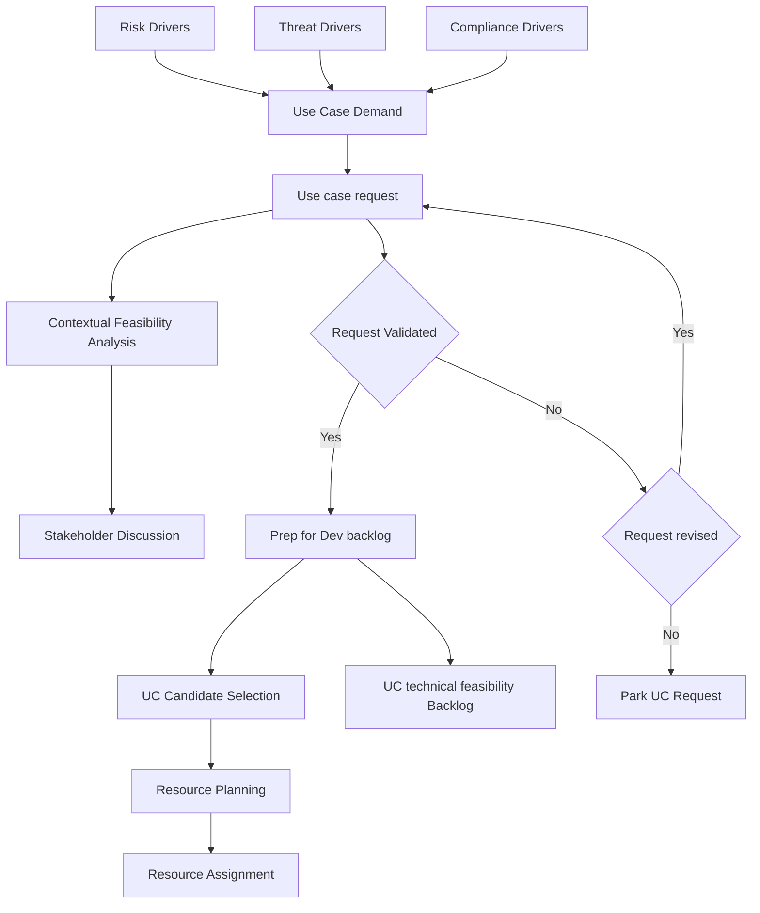

# The Planning Phase

<!-- journey:where -->
*Walk the lifecycle › Planning*
<!-- /journey:where -->

A detection program always receives more requests than it can build. Planning
decides which requests become detections, in what order, and with what
resources. It establishes why a detection is needed, when it is needed by, who
has an interest in it, and what must be in place before development can begin.

> **Running example.** Planning for the consent phishing detection produced
> request `UC-2026-0001`. It recorded the threat and risk drivers, the assets in
> scope and those deliberately excluded, and measurable success criteria. Scored
> with the rubric described below, it ranked first in the backlog. See
> [stages 1 and 2 of the example](worked-example.md#stage-1-business-driver).

The sections below cover the benefits of planning from the top down, the
elements a use case request must make concrete, the contextual feasibility
analysis, and how requests are prioritized and resourced.

## Overview

Planning answers four questions before any engineering begins: why the
detection is needed, when it is needed by, who has a stake in it, and what must
be in place to build it. The framework plans from the top down, starting with
the organization's objectives and working towards individual detections, so
that each request is judged against the whole picture rather than in isolation.

### Benefits of Top-Down Planning

#### Key Advantages

- **Better decisions.** Starting from the organization's security objectives
  surfaces risks and obstacles early, when the choice of use cases,
  technologies and resources can still change.
- **Shared goals.** Involving stakeholders from across the organization builds
  a common view of priorities, so effort goes to the most important needs.
- **Smoother change.** Considering the effect of a new detection on existing
  systems, processes and workflows exposes conflicts and dependencies before
  they cause disruption.
- **Less wasted time.** Requirements agreed at the start reduce delay, rework
  and repeated iterations later.
- **Fewer errors.** A structured approach finds pitfalls and dependencies while
  they are still cheap to address.

## Use Case Development Requirements

Before a use case can be developed, several of its elements need to be made
concrete.

### Essential Elements

- **Scope and objectives.** What the use case covers, what it is for, and what
  outcome is expected.
- **Stakeholder input.** The people who depend on the use case are involved
  from the start, so that it meets their needs.
- **Documentation.** The request is recorded, and serves as the reference point
  for development and delivery.
- **Development plan.** The steps, milestones and resources needed to build it.
- **High-level needs.** The questions the detection must answer, turned into
  discrete requirements for its logic.
- **Contextual feasibility.** An analysis confirming that the use case fits the
  organization's objectives and circumstances, described in the next section.

---

## Contextual Feasibility Analysis

Without planning, detection development tends to be late, inaccurate and
confused. The contextual feasibility analysis prevents this by establishing
the context of a request before technical work begins: the drivers behind it,
when it is needed, and what it will take to build. The analysis is normally
captured on an intake form and kept as a record, which preserves the
traceability of the eventual detection back to its reasons.

### Components Analysis

The analysis covers eleven components. Each is described below with the
question it answers and what goes wrong without it.

### Component Details

#### **Objective**

What the use case must achieve, technically and for the organization. Without
a clear objective, development drifts and may miss the threat that mattered.

#### **Drivers**

The risk, threat or compliance reasons for the request. Drivers connect the
use case to the organization's priorities; without them it is impossible to
judge whether the detection addresses a real need.

#### **Scope**

The systems, data, applications and people the use case protects, and those it
deliberately does not. Without a defined scope, a use case either misses
critical assets or tries to cover everything.

#### **Purpose**

Why the use case is worth building and what it will deliver. A stated purpose
makes the request possible to prioritize and to explain to stakeholders.

#### **Value**

The impact of losing the protected assets or interrupting the processes they
support. Value guides prioritization, so that effort goes to what matters most.

#### **Priority**

How urgent the use case is and by when it is needed. Priority ensures that the
most pressing risks are addressed first.

#### **Stakeholders**

The departments and people with an interest in the use case. Their involvement
brings in the knowledge the detection depends on, and the support it needs to
succeed.

#### **Alignment**

How the use case fits with other parts of the organization and their
processes. Alignment prevents a new detection from disrupting existing
workflows or systems.

#### **Outputs**

The alerts, reports and measures by which the use case's effectiveness will be
judged. Without defined outputs, its value cannot be assessed.

#### **Resourcing**

The people, tools and technology needed to build the use case, inside and
outside the team. Resourcing identified early prevents development stalling
for lack of skills or infrastructure.

#### **Backlog**

The prioritized list of use cases waiting to be built. A maintained backlog
keeps development aligned with the organization's priorities rather than with
whichever request arrived last.

---

## Preparing for Development

Once a request is understood, two further decisions prepare it for
development: where it ranks against other requests, and who will build it.

### Priority Management

Unanchored scoring is not reproducible. Asking two engineers to rate a request
"0 to 10 for urgency" produces two different backlogs, because nothing defines
what a 7 means. A conforming program MUST use anchored descriptors so that
independent scorers converge.

**PLN-1.** Use case requests MUST be scored using a published rubric in which
every score level has a written descriptor. Bare numeric scales without
descriptors MUST NOT be used.

#### The scoring model

Requests are scored on five dimensions. The Priority Score is:

$$
\text{Priority} = \frac{(T \times 3) + (A \times 3) + (G \times 2)}{C + M}
$$

Benefit sits in the numerator, cost in the denominator. The weights reflect that
a detection's value is driven primarily by *who is being attacked* and *what it
protects*, and only secondarily by how large the gap is.

#### Dimension 1: Threat relevance (T), 1-5

How credible is this threat against *this* organization?

| Score | Descriptor |
| --- | --- |
| 5 | Observed in the organization's environment, or a confirmed campaign against the organization in the last 90 days |
| 4 | Confirmed active against the organization's sector, named in a current CISA/NCSC/ISAC advisory |
| 3 | Actively exploited in the wild generally; no sector-specific reporting |
| 2 | Published technique with proof-of-concept tooling; no observed exploitation |
| 1 | Theoretical or research-stage technique |

#### Dimension 2: Asset criticality (A), 1-5

What does this detection protect?

| Score | Descriptor |
| --- | --- |
| 5 | Crown jewel: loss causes material financial, safety or regulatory harm; named in the BIA as tier 1 |
| 4 | Business-critical system or privileged identity infrastructure |
| 3 | Production system supporting a business process with a documented workaround |
| 2 | Supporting or internal system; degradation tolerable for days |
| 1 | Development, test or sandbox environment |

#### Dimension 3: Coverage gap (G), 1-5

How exposed is the organization today?

| Score | Descriptor |
| --- | --- |
| 5 | No detection and no compensating preventive control |
| 4 | No detection; a preventive control exists but is known to be bypassable |
| 3 | Partial detection with known blind spots, or detection exists at a lower confidence tier |
| 2 | Detection exists but is brittle (see [Detection Robustness](detection-robustness.md)) |
| 1 | Robust detection already in place; this request is an enhancement |

#### Dimension 4: Build cost (C), 1-5

| Score | Descriptor |
| --- | --- |
| 1 | Existing telemetry, existing pattern, under one engineer-day |
| 2 | Existing telemetry, new logic, under one engineer-week |
| 3 | Requires enrichment, correlation across sources, or a new baseline |
| 4 | Requires onboarding a new log source already available in the estate |
| 5 | Requires new instrumentation, agent deployment, or vendor change |

#### Dimension 5: Maintenance burden (M), 1-5

| Score | Descriptor |
| --- | --- |
| 1 | Deterministic logic, stable telemetry, no expected tuning |
| 2 | Occasional exception maintenance expected |
| 3 | Threshold or baseline requires periodic recalibration |
| 4 | High environmental sensitivity; expected to break on infrastructure change |
| 5 | Requires continuous curation (for example, indicator lists or user-behavior baselines) |

#### Worked example

| Request | T | A | G | C | M | Priority | Rank |
| --- | --- | --- | --- | --- | --- | --- | --- |
| Detect OAuth consent phishing against executive tenants | 5 | 5 | 4 | 2 | 2 | `(15+15+8)/4` = **9.50** | 1 |
| Detect Kerberoasting | 3 | 4 | 3 | 2 | 1 | `(9+12+6)/3` = **9.00** | 2 |
| Detect credential dumping via LSASS access | 4 | 5 | 2 | 3 | 3 | `(12+15+4)/6` = **5.17** | 3 |
| Detect anomalous data egress volume | 3 | 4 | 5 | 4 | 5 | `(9+12+10)/9` = **3.44** | 4 |

The fourth request has the largest coverage gap but the worst cost profile, and
the rubric ranks it last. An anchored rubric changes the discussion from which
number to assign to whether the descriptor fits, which is easier to settle.

#### Rules of use

**PLN-2.** Scores MUST be recorded in the use case request record, not derived
ad hoc at backlog grooming, so that prioritization decisions remain auditable.

**PLN-3.** A request scoring `T = 5` MUST be routed to the expedited path
defined in the [Adoption Guide](from-theory-to-practice.md) rather than queued by
Priority Score. Active compromise does not wait for the backlog.

**PLN-4.** Compliance-driven requests carry a hard deadline and MUST be
scheduled against that deadline. They are tracked on the same backlog for
capacity purposes but are not subject to Priority Score ordering.

**PLN-5.** The backlog MUST be re-scored at least quarterly. Threat relevance
decays; a score from twelve months ago is not evidence.

#### Key Considerations

- The backlog is reviewed on a published cadence, and development starts from
  the highest-scoring request.
- Where Priority Scores tie, the request with the lower build cost goes first,
  so that available capacity delivers the most detections.

### Resource Planning

#### Resource Identification

A use case is usually built by the SOC or a dedicated content team, with help
from other functions:

- **Internal:** IT and infrastructure teams for system access and changes,
  security engineering for technical expertise, and network teams for
  connectivity and log transport.
- **External:** managed security service providers, contractors with
  specialist skills, and online marketplaces of prebuilt detection content.

**Formal alignment.** The people identified must be available and committed.
An operational or service level agreement records what each party will
provide, by when, and through which communication channels.

---

## Example Process Steps for Planning Phase

The flow below shows how a request moves from its drivers to the development
backlog, including the decisions at which it can be revised or parked.

---

## In brief

- Every detection starts as a recorded use case request that states its
  business driver, scope, non-goals and measurable success criteria.
- A contextual feasibility analysis establishes objective, value, stakeholders
  and resourcing before any technical work begins.
- Requests are ranked with an anchored rubric. Each score level has a written
  descriptor, so independent scorers reach the same result.
- Confirmed active threats take an expedited path, and compliance requests are
  scheduled against their deadlines rather than ranked.

## Requirements in this chapter

`PLN-1` to `PLN-5` are set out above. `PLN-6` to `PLN-8`, covering non-goals,
success criteria and the feasibility gate, are in the
[specification](specification.md#4-planning-phase), which also lists the
conformance level of each.

## What comes next

Planning relies on clear ownership: someone must score requests, resolve
disputes and approve what is built. [Governance and roles](governance-and-roles.md)
describes the functions and decision-making body behind these steps. Readers
following the core path can continue directly to
[the technical feasibility phase](development-phase-A.md), where an accepted
request is tested against the telemetry actually available.

<!-- journey:next -->

---

**Previous:** [A detection's journey](worked-example.md) · **Next:** [Going deeper: Governance and roles](governance-and-roles.md)

<!-- /journey:next -->
