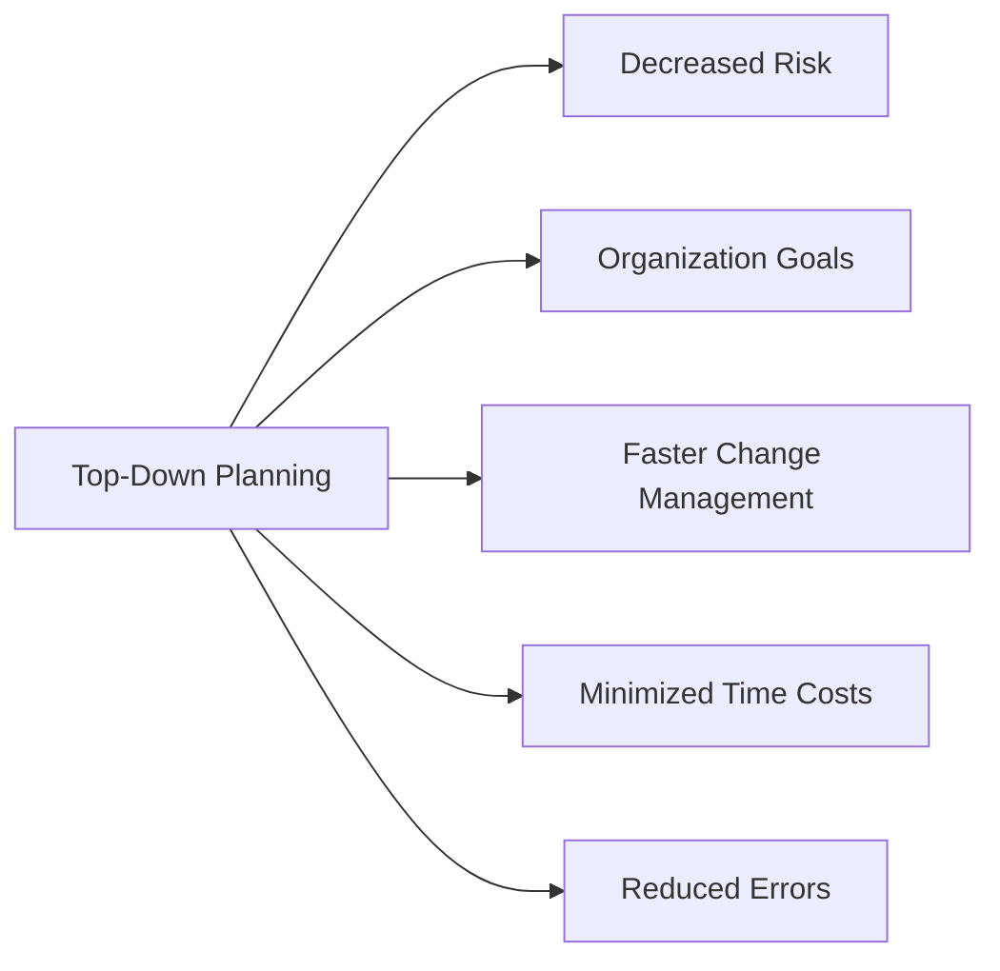
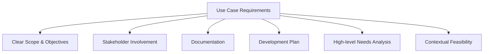
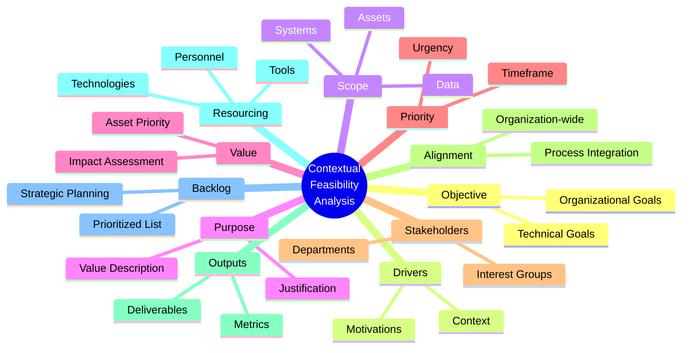
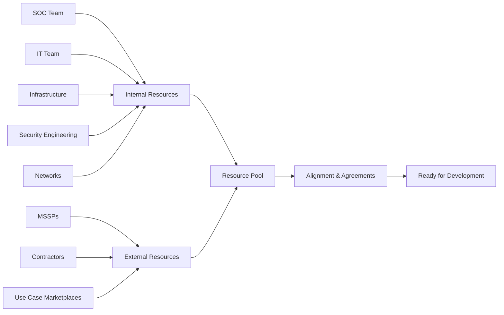
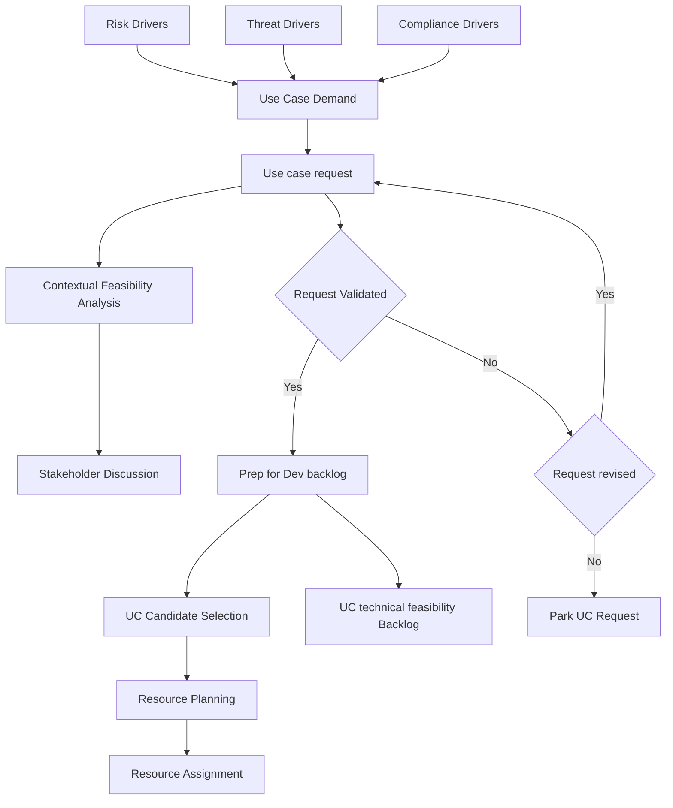

# Planning Phase

*[Framework index](README.md) · [Specification](specification.md) · [Conformance](conformance-model.md)*

> This phase defines the **why**, **when**, **who** & **what** needs to be in place to commence the development of the use case.

## Overview

The planning phase in detection engineering is a crucial step that sets the foundation for the development and implementation of effective use cases. This phase involves defining the why, when, who, and what aspects necessary to commence the development process. By taking a top-down approach, organizations can gain a comprehensive understanding of the big picture and all its components, leading to more informed decision-making and improved outcomes.

### Benefits of Top-Down Planning

#### Key Advantages

**Decreased Risk in Decision-Making**

- By starting with a holistic view of the organization's security requirements and objectives, potential risks and challenges can be identified early on
- This allows for more informed choices regarding the selection of use cases, technologies, and resources required for implementation

**Organization-wide Goals**

- By involving stakeholders from different departments and levels of the organization, a shared understanding of security priorities and objectives can be established
- This alignment ensures that the development efforts are focused on addressing the most critical security needs and supporting the overall business strategy

**Faster Change Management**

- By considering the impact of new use cases on existing systems, processes, and workflows, organizations can proactively identify potential conflicts or dependencies
- This enables them to develop strategies to minimize disruption and optimize the integration of new detection capabilities into the existing security infrastructure

**Minimized Time Costs**

- By investing time upfront to define requirements, gather input from stakeholders, and create a clear roadmap, organizations can streamline the development process
- This reduces the likelihood of delays, rework, or unnecessary iterations during the implementation phase

**Error Minimization**

- By taking a systematic and structured approach, organizations can identify potential pitfalls, dependencies, and challenges early on
- This allows for better risk mitigation strategies and the implementation of robust quality assurance measures

## Use Case Development Requirements

To successfully develop and onboard new use cases, specific elements of the use case need to be made concrete:

### Essential Elements

- **Scope & Objectives**: Clearly defining the scope, objectives, and expected outcomes of the use case
- **Stakeholder Input**: Stakeholders who provide input into the use case development process should be actively involved to ensure proper alignment with their needs and requirements
- **Documentation**: The use case request should be documented to serve as a crucial reference point throughout the development and implementation process
- **Development Plan**: Developing a plan is essential to guide the use case development process, outlining steps, milestones, and resources needed
- **High-level Needs**: Determined through formulating questions that channel the need for information into discrete requirements for developing the logic or detection capabilities
- **Contextual Feasibility**: Analysis conducted to ensure that the use case aligns with the business objectives and requirements

---

## Contextual Feasibility Analysis

> Without the planning phase the development of the use cases could be **delayed**, **inaccurate** and could cause extended amount of **confusion** during the development phase.

It is important to understand the organization's drivers or context behind the need for the use case as much as when the use cases are needed by and what resources would it need to build the use case. Such feasibility exercise is usually gathered in the form of an internal form which is then kept on record for historical record keeping and traceability purposes.

### Components Analysis

### Component Details

#### **Objective**
>
> *Clearly defining the technical and organizational objectives of the use case*

Without well-defined objectives, the use case may lack focus and fail to address the organization's specific security needs. It is akin to embarking on a journey without a destination in mind. Without clear objectives, the development team may wander aimlessly, resulting in wasted time and resources, and potentially missing critical security threats.

#### **Drivers**
>
> *Identifying the reasons and motivations behind developing the use case*

This helps provide context and ensure alignment with the organization's goals and priorities. Without a clear understanding of the drivers, the use case may not effectively address the organization's security challenges. An analogy could be driving a car without knowing the destination or purpose.

#### **Scope**
>
> *Defining the assets (systems, data, applications, people, etc.) that need to be protected*

This is crucial for focusing development efforts and ensuring comprehensive coverage. Without a well-defined scope, the use case may either overlook critical assets or try to protect too many irrelevant elements. Imagine building a fence around a property without defining its boundaries.

#### **Purpose**
>
> *Describing the scope and value of the use case*

This helps establish its importance and justification. It provides a clear understanding of why the use case is needed and what benefits it brings to the organization. Without a clear purpose, the development team may struggle to prioritize the use case or communicate its value to stakeholders.

#### **Value**
>
> *Assessing the potential impacts of losing the identified assets or interrupting critical processes*

This helps prioritize use cases based on their potential impact. Understanding the value of protecting these assets is crucial for making informed decisions about resource allocation and risk management. Without assessing value, the development team may invest resources in less critical use cases while neglecting higher-priority ones.

#### **Priority**
>
> *Determining the urgency and timeframe within which the use case needs to be developed*

This ensures that critical security needs are addressed promptly. It helps prevent delays and ensures that the most pressing risks are mitigated in a timely manner. Without prioritization, the development team may focus on low-impact use cases while neglecting those with higher urgency.

#### **Stakeholders**
>
> *Identifying the departments and stakeholders who have an interest in the use case*

This is vital for gathering input, ensuring alignment, and fostering collaboration. Involving relevant stakeholders promotes a sense of ownership and helps capture diverse perspectives. Without stakeholder involvement, the use case may lack input from critical areas, resulting in a solution that fails to meet their needs or gain their support.

#### **Alignment**
>
> *Ensuring alignment with every relevant part of the organization*

This helps minimize conflicts, streamline integration, and optimize effectiveness. It allows for the smooth coordination of security operations with other business processes and ensures that the use case does not inadvertently disrupt existing workflows or systems.

#### **Outputs**
>
> *Defining the required outputs to measure and monitor the effectiveness of the use case*

This is essential for evaluating its performance and making informed decisions. It helps establish metrics, alerts, reports, or other deliverables that provide insights into the use case's efficacy. Without clear outputs, it becomes challenging to assess the impact and value of the use case.

#### **Resourcing**
>
> *Identifying the internal and extended resources required for the development phase*

This ensures that the necessary personnel, tools, and technologies are available to successfully implement the use case. It helps allocate resources effectively, preventing resource shortages or inadequate support. Without proper resourcing, the development team may lack the necessary expertise, tools, or infrastructure.

#### **Backlog**
>
> *Maintaining a list of prioritized use cases that need to be developed*

This allows for strategic planning and effective backlog management. It ensures that development efforts align with the organization's priorities and helps avoid ad-hoc decision-making or resource allocation. Without a backlog, the development team may struggle to prioritize and manage the development of multiple use cases.

---

## Preparing for Development

The planning phase of detection engineering involves several crucial considerations to ensure a successful development process.

### Priority Management

> **Normative status.** Requirement identifiers of the form `PLN-n` are testable
> conformance criteria. See [Conformance Model](conformance-model.md).

Unanchored scoring is not reproducible. Asking two engineers to rate a request
"0 to 10 for urgency" produces two different backlogs, because nothing defines
what a 7 means. A conforming program MUST use anchored descriptors so that
independent scorers converge.

**PLN-1.** Use case requests MUST be scored using a published rubric in which
every score level has a written descriptor. Bare numeric scales without
descriptors MUST NOT be used.

#### The scoring model

Requests are scored on five dimensions. The Priority Score is:

$$
\text{Priority} = \frac{(T \times 3) + (A \times 3) + (G \times 2)}{C + M}
$$

Benefit sits in the numerator, cost in the denominator. The weights reflect that
a detection's value is driven primarily by *who is being attacked* and *what it
protects*, and only secondarily by how large the gap is.

#### Dimension 1: Threat relevance (T), 1-5

How credible is this threat against *this* organization?

| Score | Descriptor |
| --- | --- |
| 5 | Observed in our environment, or a confirmed campaign against our organization in the last 90 days |
| 4 | Confirmed active against our sector, named in a current CISA/NCSC/ISAC advisory |
| 3 | Actively exploited in the wild generally; no sector-specific reporting |
| 2 | Published technique with proof-of-concept tooling; no observed exploitation |
| 1 | Theoretical or research-stage technique |

#### Dimension 2: Asset criticality (A), 1-5

What does this detection protect?

| Score | Descriptor |
| --- | --- |
| 5 | Crown jewel: loss causes material financial, safety or regulatory harm; named in the BIA as tier 1 |
| 4 | Business-critical system or privileged identity infrastructure |
| 3 | Production system supporting a business process with a documented workaround |
| 2 | Supporting or internal system; degradation tolerable for days |
| 1 | Development, test or sandbox environment |

#### Dimension 3: Coverage gap (G), 1-5

How exposed are we today?

| Score | Descriptor |
| --- | --- |
| 5 | No detection and no compensating preventive control |
| 4 | No detection; a preventive control exists but is known to be bypassable |
| 3 | Partial detection with known blind spots, or detection exists at a lower confidence tier |
| 2 | Detection exists but is brittle (see [Detection Robustness](detection-robustness.md)) |
| 1 | Robust detection already in place; this request is an enhancement |

#### Dimension 4: Build cost (C), 1-5

| Score | Descriptor |
| --- | --- |
| 1 | Existing telemetry, existing pattern, under one engineer-day |
| 2 | Existing telemetry, new logic, under one engineer-week |
| 3 | Requires enrichment, correlation across sources, or a new baseline |
| 4 | Requires onboarding a new log source already available in the estate |
| 5 | Requires new instrumentation, agent deployment, or vendor change |

#### Dimension 5: Maintenance burden (M), 1-5

| Score | Descriptor |
| --- | --- |
| 1 | Deterministic logic, stable telemetry, no expected tuning |
| 2 | Occasional exception maintenance expected |
| 3 | Threshold or baseline requires periodic recalibration |
| 4 | High environmental sensitivity; expected to break on infrastructure change |
| 5 | Requires continuous curation (for example, indicator lists or user-behavior baselines) |

#### Worked example

| Request | T | A | G | C | M | Priority | Rank |
| --- | --- | --- | --- | --- | --- | --- | --- |
| Detect OAuth consent phishing against executive tenants | 5 | 5 | 4 | 2 | 2 | `(15+15+8)/4` = **9.50** | 1 |
| Detect Kerberoasting | 3 | 4 | 3 | 2 | 1 | `(9+12+6)/3` = **9.00** | 2 |
| Detect credential dumping via LSASS access | 4 | 5 | 2 | 3 | 3 | `(12+15+4)/6` = **5.17** | 3 |
| Detect anomalous data egress volume | 3 | 4 | 5 | 4 | 5 | `(9+12+10)/9` = **3.44** | 4 |

The fourth request has the largest coverage gap but the worst cost profile; the
rubric correctly ranks it last without anyone needing to argue the point. That
is the purpose of an anchored rubric: it moves the debate from *what score do we
give this* to *do we agree with the descriptor*, which is a far more tractable
conversation.

#### Rules of use

**PLN-2.** Scores MUST be recorded in the use case request record, not derived
ad hoc at backlog grooming, so that prioritization decisions remain auditable.

**PLN-3.** A request scoring `T = 5` MUST be routed to the expedited path
defined in the [Adoption Guide](from-theory-to-practice.md) rather than queued by
Priority Score. Active compromise does not wait for the backlog.

**PLN-4.** Compliance-driven requests carry a hard deadline and MUST be
scheduled against that deadline. They are tracked on the same backlog for
capacity purposes but are not subject to Priority Score ordering.

**PLN-5.** The backlog MUST be re-scored at least quarterly. Threat relevance
decays; a score from twelve months ago is not evidence.

#### Key Considerations

**Priority Determination**

- Not all use cases have the same level of urgency or importance
- Some use cases may have impending deadlines, while others are critical to the organization's security posture or address imminent threats
- Balancing benefit against build and maintenance cost is essential

**Backlog Management**

- Maintain a use case development backlog that is reviewed on a published cadence
- Begin development with the highest-scoring use cases and progressively move down the list
- Where Priority Scores tie, order by build cost ascending so that capacity delivers the most detections per sprint

### Resource Planning

#### Resource Identification

**Internal Resources**

- **SOC team** or dedicated content development team as primary resources
- Additional personnel from various domains:
- **IT**: Infrastructure support
- **Infrastructure**: System maintenance
- **Security Engineering**: Technical expertise
- **Networks**: Connectivity and transport

**External Resources**

- **Managed Security Service Providers (MSSPs)**: Professional services
- **Contractors**: Specialized skills and temporary support
- **Online use case marketplaces**: Pre-built solutions and templates

**Formal Alignment**

- Ensure identified resources are willing and formally aligned to participate
- Establish through **Operational Level Agreements (OLAs)** or **Service Level Agreements (SLAs)**
- Define expectations, responsibilities, and commitments of all parties involved
- Formalize collaboration between teams and stakeholders
- Establish clear communication channels, timelines, and deliverables

---

## Example Process Steps for Planning Phase

