# 🛠️ Tools and Templates

This directory contains practical tools and templates to implement the Detection Engineering Framework in your organization.

## 📁 Structure

### 📋 Templates
Organized by framework phase and template type:

#### 🎯 Use Case Requests (`use-case-requests/`)
- **[Standard Use Case Request](templates/use-case-requests/use-case-request-template.md)** - Comprehensive use case planning template
- **Expedited Use Case Request** - Fast-track template for urgent threats *(Coming Soon)*
- **Compliance Use Case Request** - Regulatory-focused template *(Coming Soon)*

#### 🔍 Technical Feasibility (`technical-feasibility/`)
- **Technical Analysis Template** - Development Phase A assessment *(Coming Soon)*
- **Data Source Assessment** - Infrastructure and data availability analysis *(Coming Soon)*
- **Attack Simulation Planning** - Testing and validation framework *(Coming Soon)*

#### 💻 Detection Rules (`detection-rules/`)
- **Detection Rule Documentation** - Standardized rule documentation *(Coming Soon)*
- **Rule Testing Framework** - Validation and testing templates *(Coming Soon)*
- **Performance Optimization** - Tuning and efficiency templates *(Coming Soon)*

#### 🚨 Response Playbooks (`response-playbooks/`)
- **Incident Response Template** - Standard playbook structure *(Coming Soon)*
- **Escalation Procedures** - Communication and escalation templates *(Coming Soon)*
- **Automation Integration** - SOAR and automation templates *(Coming Soon)*

#### 📊 Metrics & Tracking (`metrics-tracking/`)
- **Performance Metrics** - KPI and measurement templates *(Coming Soon)*
- **Effectiveness Assessment** - Use case success evaluation *(Coming Soon)*
- **Continuous Improvement** - Feedback and optimization templates *(Coming Soon)*

### 🔧 Tools
Utilities and scripts to support the detection engineering process:

- **Template Validation Scripts** - Automated template completeness checking *(Coming Soon)*
- **Workflow Automation** - Integration with ticketing and approval systems *(Coming Soon)*
- **Metrics Collection** - Automated performance data gathering *(Coming Soon)*

## 🚀 Getting Started

### 📋 Template Selection Guide

```mermaid
flowchart TD
    A[🎯 New Detection Need] --> B{Urgency Level?}
    
    B -->|🚨 Critical/Zero-Day| C[⚡ Expedited Use Case]
    B -->|📜 Compliance Driven| D[📊 Compliance Use Case]
    B -->|🔄 Standard Process| E[📋 Standard Use Case]
    
    E --> F[📍 Planning Phase]
    C --> F
    D --> F
    
    F --> G[🔍 Technical Feasibility]
    G --> H[💻 Detection Rules]
    H --> I[🚨 Response Playbooks]
    I --> J[📊 Metrics & Tracking]
    
    style A fill:#2c3e50
    style B fill:#e74c3c
    style C fill:#f39c12
    style D fill:#3498db
    style E fill:#27ae60
    style F fill:#9b59b6
```

### 🎪 Framework Integration

1. **📋 Start with Use Case Request** - Define business need and requirements
2. **🔍 Conduct Technical Feasibility** - Assess implementation viability  
3. **💻 Develop Detection Rules** - Create and document detection logic
4. **🚨 Build Response Playbooks** - Define incident response procedures
5. **📊 Establish Metrics** - Track performance and effectiveness

## 📊 Template Categories

### 🎯 By Framework Phase
- **Planning Phase** → Use Case Requests
- **Development Phase A** → Technical Feasibility
- **Development Phase B** → Detection Rules  
- **Development Phase C** → Response Playbooks
- **All Phases** → Metrics & Tracking

### 🏢 By Organizational Function
- **Business Stakeholders** → Use Case Requests, Metrics
- **Security Architects** → Technical Feasibility, Detection Rules
- **SOC Analysts** → Response Playbooks, Metrics
- **Compliance Teams** → Specialized compliance templates

## ✅ Template Quality Standards

- **Framework Alignment**: All templates map to specific framework phases
- **Comprehensive Guidance**: Detailed instructions and examples included
- **Stakeholder Integration**: Clear roles and responsibilities defined
- **Traceability Support**: Links business drivers to technical implementation
- **Version Control Ready**: Designed for document lifecycle management

## 🤝 Contributing

### 📋 Contribution Guidelines
- Follow existing template structure and formatting standards
- Include comprehensive guidance comments and examples
- Test templates with real-world scenarios before submission
- Document any dependencies or prerequisites clearly
- Maintain consistency with Detection Engineering Framework terminology

### 🔄 Template Development Process
1. **Identify Need** - Gap analysis in current template coverage
2. **Design Template** - Create structure aligned with framework phases
3. **Add Guidance** - Include helpful comments and examples
4. **Test & Validate** - Use template in real scenarios
5. **Documentation** - Create usage guidelines and integration notes
6. **Community Review** - Submit for feedback and refinement

---

## 📚 Related Documentation

- **[Detection Engineering Framework](../README.md)** - Main framework documentation
- **[Planning Phase](../planning-phase.md)** - Detailed planning methodology
- **[Development Phases](../development-phase-A.md)** - Development implementation guidance
- **[Best Practices](../best-practices.md)** - Advanced implementation strategies

---

*These templates support the Detection Engineering Framework methodology. For complete framework documentation, see the main repository.*

**Version:** 2.0  
**Last Updated:** September 2025  
**Maintainer:** Detection Engineering Framework Community
