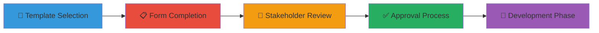

# 📋 Use Case Request Templates

This directory contains templates for initiating new detection use cases within the Detection Engineering Framework.

## 📁 Available Templates

### 🎯 Primary Templates
- **[use-case-request-template.md](use-case-request-template.md)** - Standard use case request form (Markdown)

### 🛠️ Codified Forms for Popular Tools
These files provide ready-to-copy field/section structures for the most common enterprise form tools. Users can lift these and manually create forms in their own environments:

- **salesforce-use-case-request-form.txt** – Field definitions for a Salesforce custom object
- **servicenow-use-case-request-form.txt** – Field/variable definitions for a ServiceNow Record Producer
- **microsoft-forms-use-case-request-form.txt** – Section and question structure for Microsoft Forms
- **google-forms-use-case-request-form.txt** – Section and question structure for Google Forms

Each file contains:
- Field names and types
- Section headers
- Sample values/options
- Instructions for manual creation/import

No external links or dependencies—just copy the file and use in your tool.

### 🚀 Planned Templates
- **expedited-use-case-template.md** - Fast-track template for urgent/zero-day threats *(Coming Soon)*
- **compliance-use-case-template.md** - Specialized template for regulatory requirements *(Coming Soon)*
- **threat-intel-use-case-template.md** - Template for threat intelligence-driven use cases *(Coming Soon)*

## 📈 Usage Guidelines

1. Select the appropriate template or codified form for your tool.
2. Copy the field/section structure into your organizational platform.
3. Customize as needed for your environment.
4. Track through lifecycle using the status tracking section.

## 🔄 Template Lifecycle

---

**Directory Version:** 1.1  
**Last Updated:** September 2025  
**Framework Phase:** Planning Phase
