# 📋 Use Case Request Templates

This directory contains templates for initiating new detection use cases within the Detection Engineering Framework.

## 📁 Available Templates

### 🎯 Primary Templates
- **[use-case-request-template.md](use-case-request-template.md)** - Standard use case request form

### 🚀 Planned Templates
- **expedited-use-case-template.md** - Fast-track template for urgent/zero-day threats *(Coming Soon)*
- **compliance-use-case-template.md** - Specialized template for regulatory requirements *(Coming Soon)*
- **threat-intel-use-case-template.md** - Template for threat intelligence-driven use cases *(Coming Soon)*

## 🎪 When to Use These Templates

### 📊 Standard Use Case Request
- **Purpose**: Comprehensive planning for new detection capabilities
- **Timeline**: Standard development lifecycle (2-6 weeks)
- **Complexity**: Medium to high complexity use cases
- **Stakeholders**: Multiple departments, formal approval process

### ⚡ Expedited Use Case *(Planned)*
- **Purpose**: Rapid response to active threats or zero-day exploits
- **Timeline**: Emergency deployment (hours to days)
- **Complexity**: Simple to medium complexity
- **Stakeholders**: Security team with streamlined approval

### 📜 Compliance Use Case *(Planned)*
- **Purpose**: Meeting specific regulatory or audit requirements
- **Timeline**: Compliance deadline-driven
- **Complexity**: Variable, often well-defined requirements
- **Stakeholders**: Compliance, legal, and security teams

## 📈 Usage Guidelines

1. **Select appropriate template** based on urgency and complexity
2. **Complete all required sections** - guidance comments help identify mandatory vs. optional fields
3. **Engage stakeholders early** - use stakeholder section to ensure proper involvement
4. **Track through lifecycle** - use status tracking section for progress monitoring

## 🔄 Template Lifecycle

```mermaid
graph LR
    A[📠Template Selection] --> B[📋 Form Completion]
    B --> C[👥 Stakeholder Review]
    C --> D[✅ Approval Process]
    D --> E[🔧 Development Phase]
    
    style A fill:#3498db
    style B fill:#e74c3c
    style C fill:#f39c12
    style D fill:#27ae60
    style E fill:#9b59b6
```

---

**Directory Version:** 1.0  
**Last Updated:** September 2025  
**Framework Phase:** Planning Phase
